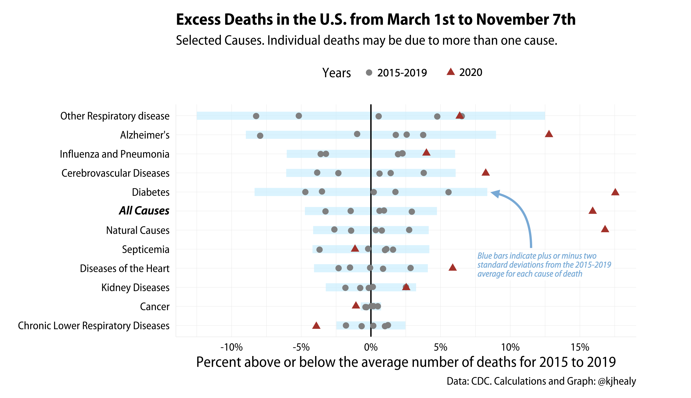
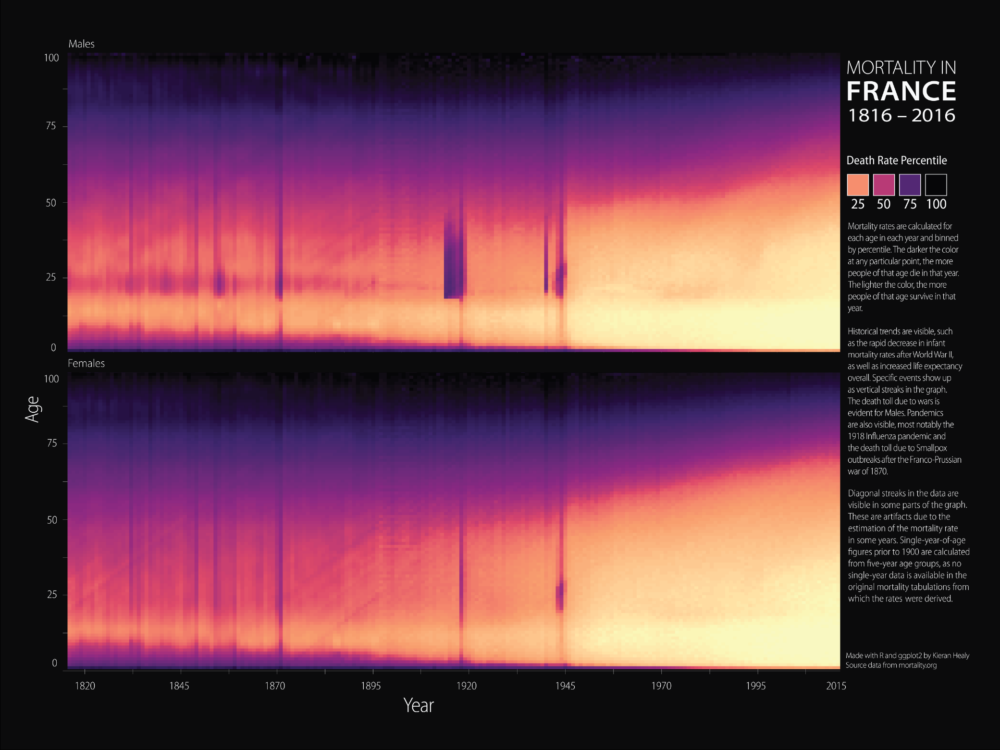
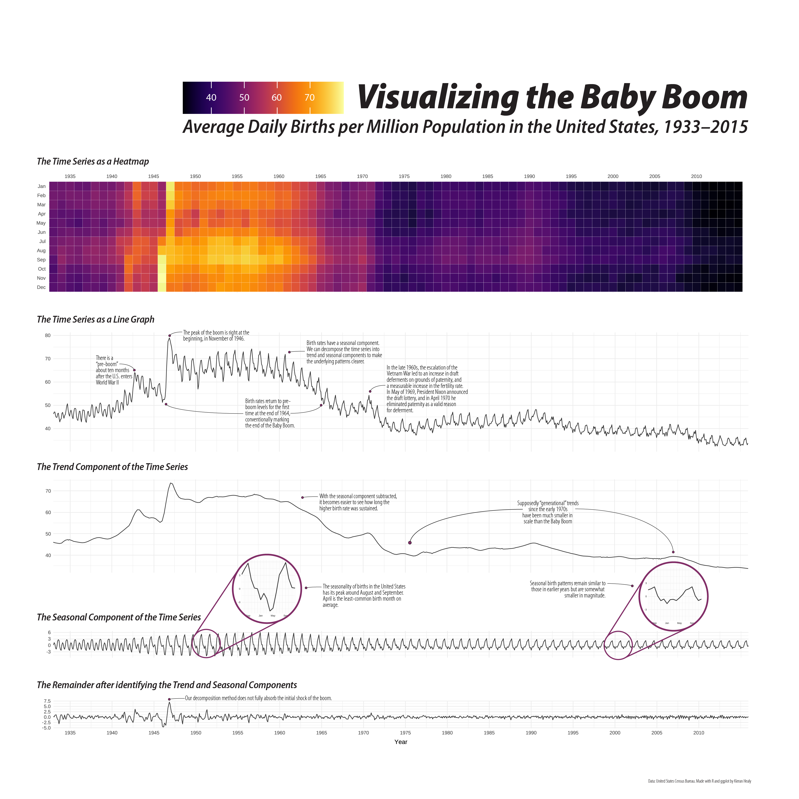
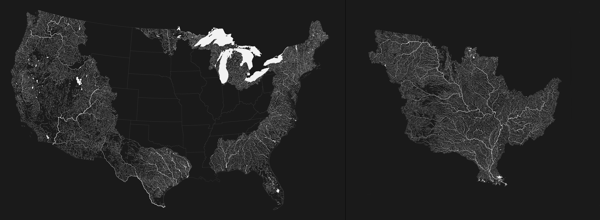
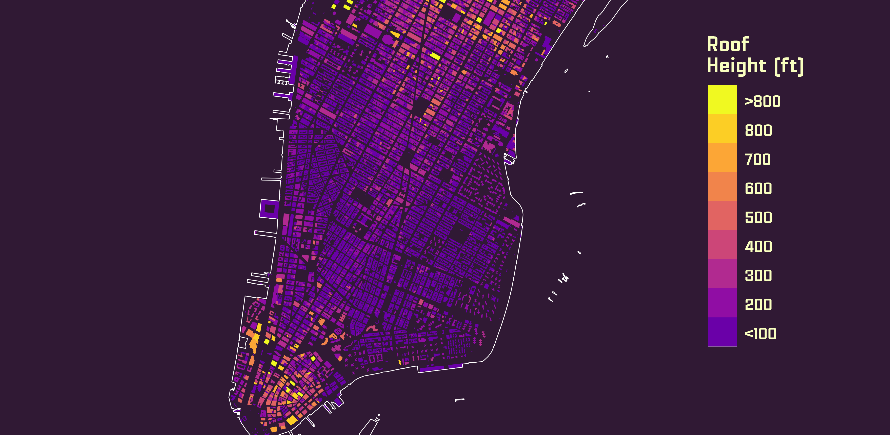
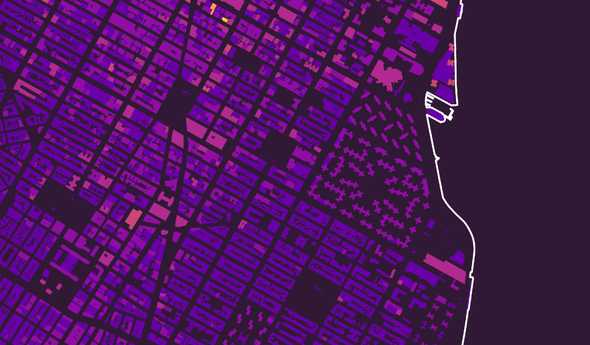

```{r packages, include=FALSE}
library(flipbookr)
library(here)
library(tidyverse)
library(kjhslides)
```


```{r setup, include=FALSE}

kjh_register_tenso()
kjh_set_knitr_opts()
kjh_set_slide_theme()
kjh_set_xaringan_opts()


# Safe
```

class: center middle main-title section-title-1

# .kjh-yellow[Visualizing]<br /> .kjh-lblue[Social Data]

.class-info[

**Week 01**

.light[Kieran Healy<br>
Duke University, Spring 2023]

]

---

layout: false
class: main-title main-title-inv

# .middle.center.huge.squish4.kjh-lblue[What we'll be Doing]

---

.center[]

---

.center[]

---

.center[]

---

.center[]

---

.center[]

---

.center[]

---

.center[]

---

.center[]

---


layout: true
class: title title-1

---

# Course Website

&nbsp;

.center.huge.squish4.kjh-lblue[[https://visualizingsociety.com](https://visualizingsociety.com)]

---


# Get up and Running: Install R

.center[]


---


# Get up and Running: Install RStudio

.center[]

---

layout: false
class: main-title main-title-inv

.center[]

---

layout: false
class: main-title main-title-inv


.center[]

---

layout: true
class: title title-1

---

# Try .kjh-yellow[knitting] your notes

.center[]

.w80.large[
- **Don't worry if it's not clear what's happening at this point.**]


---

# Now write the following code

.pull-left.w40[

Write this out inside the "code chunk" in your notes.

```{r codefig-first-plot, message=FALSE, fig.show="hide", fig.width=4, fig.height=3.5}
library(tidyverse)
library(gapminder)

p <- ggplot(data = gapminder, 
            mapping = aes(x = gdpPercap, 
                          y = lifeExp))  


p + geom_point()
```
]

--

... And knit your document again.

.pull-right.w50[
```{r 01-looking-at-data-1, echo=FALSE}
knitr::include_graphics(
  knitr::fig_chunk("codefig-first-plot", "png")
)
```
]


---


layout: true
class: center middle main-title section-title-1

---

# .huge.squish4.kjh-lblue[You should<br />.kjh-yellow[look at]<br />your data]

