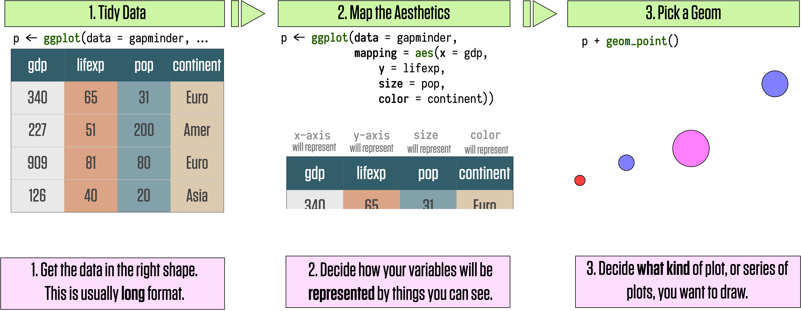
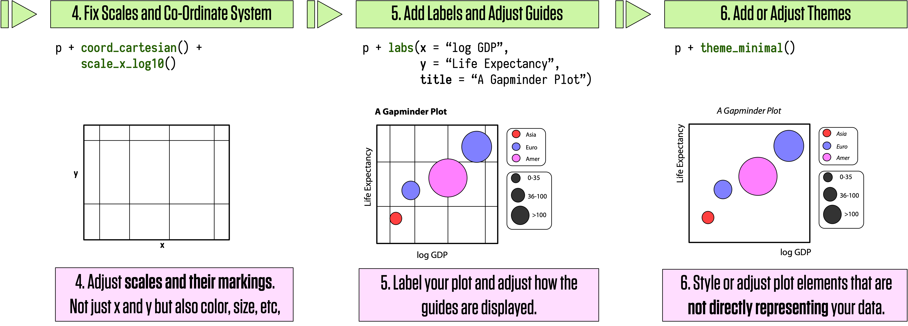
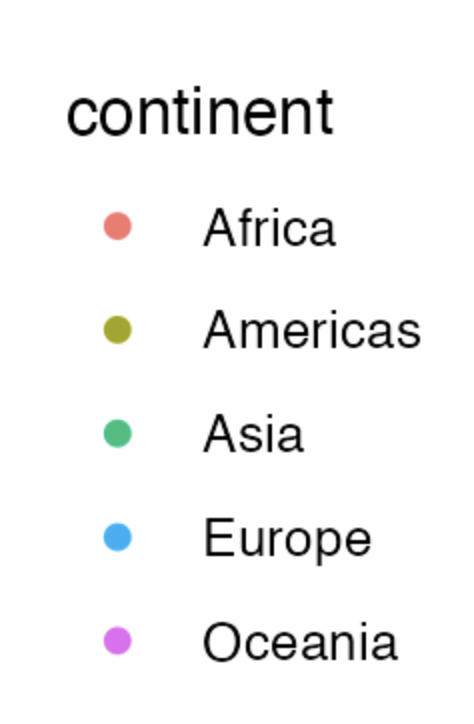

```{r packages, include=FALSE}
library(flipbookr)
library(here)
library(tidyverse)
library(kjhslides)
```


```{r setup, include=FALSE}

kjh_register_tenso()
kjh_set_knitr_opts()
kjh_set_slide_theme()
kjh_set_xaringan_opts()


# Safe
```

class: center middle main-title section-title-1

# .kjh-yellow[How ggplot]<br /> .kjh-lblue[Thinks]

.class-info[

**Week 04**

.light[Kieran Healy<br>
Duke University, Spring 2023]

]

---

---

# Load our libraries

.SMALL[
```{r 05-work-with-dplyr-and-geoms-1, message = TRUE}
library(here)      # manage file paths
library(socviz)    # data and some useful functions
library(tidyverse) # your friend and mine
library(gapminder) # some data
```
]

---

layout: true
class: title title-1

---

# Nearly done with the scaffolding


- ✅ Thought about elements of visualization

--

- ✅ Gotten oriented to R and RStudio

--

- ✅ Knitted a document 

--

- ✅ Written a bit of `ggplot` code

--


- ⬜ Get my data in to R

--

- ⬜ Make a plot with it

---
layout: false
class: bottom
background-image: url("img/03_feed_me_seymour.png")
background-size: cover

## .huge.right.bottom.squish4.kjh-grey[Feed ggplot .kjh-pink[tidy] data]

---

layout: true
class: title title-1

---

# What is .kjh-orange[tidy data]?

.center[]

---

# What is .kjh-orange[tidy data]?

.center[]

.center[Essentially: data in _long_ format.]


---

# Every column is a single variable

.center[]


---

# Every row is a single observation

.center[]


---

# Every cell is a single value

.center[]


---

# Get your data into long format

Very, _very_ often, the solution to some data-wrangling or data visualization problem in a Tidyverse-focused workflow is:

--

## .large[.kjh-pink[First], .kjh-lblue[get the data into long format].]

## Then do the thing you want.

---

# Untidy data is common for good reasons!

Storing and printing data in long format entails a lot of _repetition_ and _redundancy_:

.small[
```{r 03-make-a-graph-1 }
library(palmerpenguins)
penguins %>% 
  group_by(species, island, year) %>% 
  summarize(bill = round(mean(bill_length_mm, na.rm = TRUE),2)) %>% 
  knitr::kable()
```
]

---

# Untidy data is common for good reasons

A wide format is _easier_ and _more efficient_ to read in print:


.small[
```{r 03-make-a-graph-2 }
penguins %>% 
  group_by(species, island, year) %>% 
  summarize(bill = round(mean(bill_length_mm, na.rm = TRUE), 2)) %>% 
  pivot_wider(names_from = year, values_from = bill) %>% 
  knitr::kable()
```
]

.tiny.footnote[(Again, these tables are made directly in R with the code you see here.)]


---

# It's also common for .kjh-orange[_less_] good reasons

.center[]

---

# It's also common for .kjh-orange[_less_] good reasons

.pull-left.w70[]

.pull-right.w30[

- 😠 More than one header row

- 😡 Mixed data types in some columns

- 💀 Color and typography used to encode variables and their values 

]
---


# Fix it .kjh-yellow[before] you import it

Prevention is better than cure!

An excellent article by Karl Broman and Kara Woo: 

- .smaller.squish3[Broman KW, Woo KH (2018) "[Data organization in spreadsheets](doi:10.1080/00031305.2017.1375989)." _The American Statistician_ 78:2–10]

.center[]

---

# The most common .kjh-lblue[`tidyr`] operation

_Pivoting_ from wide to long:

.SMALL[
```{r 03-make-a-graph-3 }
edu
```

Here, a "Level of Schooling Attained" variable is spread across the columns, from `elem4` to `coll4`.


This is fine for a compact table, but we need a _key_ column called "education" with the various levels of schooling, and a corresponding _value_ column containing the counts.
]
---

# From wide to long with .kjh-green[`pivot_longer()`]

.SMALL.squish2[We're going to put the columns `elem4:coll4` into a new column, creating a new categorical measure named .kjh-orange[`education`]. The numbers currently under each column will become a  new .kjh-orange[`value`] column corresponding to that level of education. ]

```{r 03-make-a-graph-4 }
edu %>% 
  pivot_longer(elem4:coll4, names_to = "education")
```

---

# From wide to long with .kjh-green[`pivot_longer()`]

.SMALL.squish2[We can name the value column to whatever we like. Here it's a number of people.]

```{r 03-make-a-graph-5 }
edu %>% 
  pivot_longer(elem4:coll4, 
               names_to = "education", 
               values_to = "n")
```


---

class: center middle main-title section-title-1

# .huge.kjh-lblue[How to get your own data into R]

---

# Reading in CSV files

Base R has .kjh-green[`read.csv()`]

--

Corresponding tidyverse "underscored" version: .kjh-green[`read_csv()`].

It is pickier and more talkative than the Base R version. Use it instead.

---

# Where's my data? Using .kjh-green[`here()`]

If we're loading a file, it's coming from _somewhere_.

If it's a file on our hard drive somewhere, we will need to interact with the file system. We should try to do this in a way that avoids _absolute_ file paths. 

```r
# This is not portable!
df <- read_csv("/Users/kjhealy/Documents/data/misc/project/data/mydata.csv")
```

--
  
We should also do it in a way that is _platform independent_. 

This makes it easier to share your work, move it around, etc. Projects should be self-contained.

---

# Where's my data? Using .kjh-green[`here()`]

The `here` package, and .kjh-green[**`here()`**] function builds paths relative to the top level of your R project. 

```{r 03-make-a-graph-6 }
here() # this path will be different for you
```

---

# Where's the data? Using .kjh-green[`here()`]

This seminar's files all live in an RStudio project. It looks like this:

```{r 03-make-a-graph-7, echo = FALSE}
fs::dir_tree(here(), recurse = 0)
```

I want to load files from the `data` folder, but I also want _you_ to be able to load them. I'm writing this from somewhere deep in the `slides` folder, but you won't be there. Also, I'm on a Mac, but you may not be.

---

# Where's the data? Using .kjh-green[`here()`]

 So:

```{r 03-make-a-graph-8 }
## Load the file relative to the path from the top of the project, without separators, etc
organs <- read_csv(file = here("files", "data", "organdonation.csv"))
```

--
.SMALL[

```{r 03-make-a-graph-9 }
organs
```

]

.small[And there it is.]

---

# .kjh-green[`read_csv()`] comes in different varieties


## .kjh-green[**`read_csv()`**] Field separator is a comma: .kjh-red[**`,`**]

```{r 03-make-a-graph-10 }
organs <- read_csv(file = here("files", "data", "organdonation.csv"))
```

## .kjh-green[**`read_csv2()`**] Field separator is a semicolon: .kjh-red[**`;`**]

```r
# Example only
my_data <- read_csv2(file = here("data", "my_euro_file.csv))
```

Both are special cases of .kjh-green[**`read_delim()`**]

---

# Other species are also catered to

- .kjh-green[**`read_tsv()`**] Tab separated.

- .kjh-green[**`read_fwf()`**] Fixed-width files.

- .kjh-green[**`read_log()`**] Log files (i.e. computer log files).

- .kjh-green[**`read_lines()`**] Just read in lines, without trying to parse them.

---

# Also often useful ...

- .kjh-green[**`read_table()`**]  

For data that's separated by one (or more) columns of space.


---

# And for foreign file formats ... 

## The tidyverse's .kjh-lblue[`haven`] package provides

- .kjh-green[**`read_dta()`**]  Stata

- .kjh-green[**`read_spss()`**]  SPSS

- .kjh-green[**`read_sas()`**]  SAS

- .kjh-green[**`read_xpt()`**]  SAS Transport


## Make these functions available with .kjh-green[`library`]`(haven)`

---

# You can read files remotely, too

.SMALL.squish3[
You can give these functions local files, or they can also be pointed at URLs.

Compressed files (`.zip`, `.tar.gz`) will be automatically uncompressed.

(Be careful what you download from remote locations!)]

.SMALL[
```{r 03-make-a-graph-11 }
organ_remote <- read_csv("http://kjhealy.co/organdonation.csv")

organ_remote
```
]

---

class: center middle main-title section-title-1

# .huge.kjh-lblue[A Plot's .kjh-yellow[Components]]

---

layout: true
class: title title-1

---

# What we need our code to make

.pull-left[

.center[]

]

--


- .medium[Data .kjh-pink[**represented**] by visual elements;]

--

- .medium[like .kjh-orange[_position_], .kjh-orange[_length_], .kjh-orange[_color_], and .kjh-orange[_size_];]

--

- .medium[Each measured on some .kjh-pink[**scale**];]

--

- .medium[Each scale with a labeled .kjh-pink[**guide**];]

--

- .medium[With the plot itself also .kjh-pink[**titled**] and labeled.]

---

layout: true
class: title title-1

---

class: center middle main-title section-title-1

# .huge[.kjh-yellow[How `ggplot`]<br />.kjh-lblue[does this]]

---

# .kjh-lblue[`ggplot`]'s flow of action

## .kjh-large.center[Here's the whole thing from start to finish]

.center[]

## .kjh-large.center[We'll go through it step by step]

---

# .kjh-lblue[`ggplot`]'s flow of action

.center[]


---

# .kjh-lblue[`ggplot`]'s flow of action

.center[]

---


# .kjh-lblue[`ggplot`]'s flow of action

.center[]

---

# .kjh-lblue[`ggplot`]'s flow of action

.center[]


---

# .kjh-lblue[`ggplot`]'s flow of action: .kjh-red[required]

.center[]


---

# .kjh-lblue[`ggplot`]'s flow of action: .kjh-red[required]

.center[]


---

# .kjh-lblue[`ggplot`]'s flow of action: .kjh-red[required]

.center[]

---

class: right bottom main-title section-title-1

## .huge.right.bottom.squish4.kjh-yellow[Let's go piece by piece]


---

# Start with the data

```{r 03-make-a-graph-12 }
gapminder
```

```{r 03-make-a-graph-13 }
dim(gapminder)
```

---

# Create a plot object

## Data is the .kjh-orange[`gapminder`] tibble.


```{r 03-make-a-graph-14 }
p <- ggplot(data = gapminder)
```

## Map variables to aesthetics

## Tell .kjh-lblue[`ggplot`] the variables you want represented by visual elements on the plot

```{r 03-make-a-graph-15 }
p <- ggplot(data = gapminder,
            mapping = aes(x = gdpPercap,
                          y = lifeExp))
```

---

# Map variables to aesthetics

## The .kjh-orange[`mapping`] `=` .kjh-green[`aes(...)`] call links variables to things you will see on the plot.

## `x` and `y` represent the quantities determining position on the x and y axes.

## Other aesthetic mappings can include, e.g., `color`, `shape`, `size`, and `fill`. 

---
layout: false
class: main-title main-title-inv

## .middle.large.squish4[.kjh-orange[Mappings] do not _directly_ specify the particular, e.g., colors, shapes, or line styles that will appear on the plot. Rather, they establish .kjh-orange[_which variables_] in the data will be represented by .kjh-orange[_which visible elements_] on the plot.]

---

layout: true
class: title title-1

---

# .kjh-orange[`p`] has data and mappings but no geom

```{r 03-make-a-graph-16, fig.cap='This empty plot has no geoms.', fig.width=8, fig.height=5}
p
```

---

# Add a geom

```{r 03-make-a-graph-17, fig.cap='A scatterplot of Life Expectancy vs GDP', fig.width=8, fig.height=5}
p + geom_point() 
```

---

# Try a different geom

```{r 03-make-a-graph-18, fig.cap='A scatterplot of Life Expectancy vs GDP', fig.width=8, fig.height=5}
p + geom_smooth() 
```

---

# Build your plots layer by layer

```{r 03-make-a-graph-19, fig.cap='Life Expectancy vs GDP, using a smoother.', fig.width=8, fig.height=5}

p <- ggplot(data = gapminder,
            mapping = aes(x = gdpPercap,
                          y=lifeExp))
p + geom_smooth()

```


---

# This process is additive

```{r 03-make-a-graph-20, fig.cap='Life Expectancy vs GDP, using a smoother.', fig.width=8, fig.height=5}

p <- ggplot(data = gapminder,
            mapping = aes(x = gdpPercap,
                          y=lifeExp))
p + geom_point() + geom_smooth()

```

---
`r chunk_reveal("reveal-additive1", widths = c(35,65), title = "# This process is additive")`

```{r reveal-additive1, include = FALSE}
p <- ggplot(data = gapminder,
            mapping = aes(x = gdpPercap,
                          y=lifeExp))
p + geom_smooth() + 
  geom_point() 
```
---

# Every .kjh-green[`geom`] is a .kjh-green[function] 

## Functions take .kjh-orange[arguments]

.pull-left.w45[
```{r codefig-functionargs, message=FALSE, fig.show="hide", fig.cap="An ill-advised linear fit", fig.width=4.8, fig.height=4.5}
p <- ggplot(data = gapminder,
            mapping = aes(x = gdpPercap,
                          y = lifeExp))
p + geom_point() + 
  geom_smooth(method = "lm") 
```
]

--

.pull-right.w55[
```{r 03-make-a-graph-21, echo=FALSE}
  knitr::include_graphics(
  knitr::fig_chunk("codefig-functionargs", "png"))
```
]

---
`r chunk_reveal("reveal-logtrans", widths = c(40,60), title = "# Keep Layering")`

```{r reveal-logtrans, include = FALSE}
 p <- ggplot(data = gapminder, 
             mapping = aes(x = gdpPercap, 
                           y=lifeExp))
p + geom_point() +
    geom_smooth(method = "lm") +
    scale_x_log10()
```
---

`r chunk_reveal("reveal-logtrans2", widths = c(50,50), title = "# Fix the labels")`

```{r reveal-logtrans2, include = FALSE}
p <- ggplot(data = gapminder, 
            mapping = aes(x = gdpPercap, 
                          y=lifeExp))
p + geom_point() +
    geom_smooth(method = "lm") +
    scale_x_log10(labels = scales::label_dollar())
```

---

# Add labels, title, and caption

.pull-left.w45[
```{r codefig-logtranslab, message=FALSE, fig.show="hide", fig.width=5, fig.height=4.5}
p <- ggplot(data = gapminder, 
            mapping = aes(x = gdpPercap, 
                          y = lifeExp))
p + geom_point() + 
  geom_smooth(method = "lm") +
    scale_x_log10(labels = scales::label_dollar()) +
    labs(x = "GDP Per Capita", 
         y = "Life Expectancy in Years",
         title = "Economic Growth and Life Expectancy",
         subtitle = "Data points are country-years",
         caption = "Source: Gapminder.")
```
]

--

.pull-right.w55[
```{r 03-make-a-graph-22, echo=FALSE}
  knitr::include_graphics(
  knitr::fig_chunk("codefig-logtranslab", "png"))
```
]

---

class: right bottom main-title section-title-1

## .huge.right.bottom.squish4[.kjh-yellow[Mapping] vs .kjh-lblue[Setting]<br />your plot's aesthetics]

---

# "Can I change the color of the points?"


```{r 03-make-a-graph-23 }
p <- ggplot(data = gapminder,
            mapping = aes(x = gdpPercap,
                          y = lifeExp,
                          color = "purple"))

## Put in an object for convenience
p_out <- p + geom_point() +
    geom_smooth(method = "loess") +
    scale_x_log10()
```

---

# What has gone wrong here?

```{r 03-make-a-graph-24, fig.width=8, fig.height=5}
p_out
```


---

# Try again

```{r 03-make-a-graph-25 }
p <- ggplot(data = gapminder,
            mapping = aes(x = gdpPercap,
                          y = lifeExp))

## Put in an object for convenience
p_out <- p + geom_point(color = "purple") +
    geom_smooth(method = "loess") +
    scale_x_log10()
```


---

# Try again

```{r 03-make-a-graph-26, fig.width=8, fig.height=5}
p_out
```

---

# Geoms can take many arguments

- Here we .kjh-orange[set] `color`, `size`, and `alpha`. Meanwhile `x` and `y` are .kjh-lblue[mapped].

- We also give non-default values to some other arguments

```{r 03-make-a-graph-27 }
p <- ggplot(data = gapminder,
            mapping = aes(x = gdpPercap,
                          y = lifeExp)) 
p_out <- p + geom_point(alpha = 0.3) +
    geom_smooth(color = "orange", 
                se = FALSE, 
                size = 8, 
                method = "lm") +
    scale_x_log10()
```

---

# Geoms can take many arguments

```{r 03-make-a-graph-28, fig.width=8.5, fig.height=5}
p_out
```

---

# Setting .kjh-orange[`alpha`] is handy for overplotted data 

.pull-left.w45[
```{r codefig-alphapoints, message=FALSE, fig.show="hide", fig.width=5, fig.height=4.5}
p <- ggplot(data = gapminder, 
            mapping = aes(x = gdpPercap, 
                          y = lifeExp))
p + geom_point(alpha = 0.3) + #<<
  geom_smooth(method = "lm") +
    scale_x_log10(labels = scales::label_dollar()) +
    labs(x = "GDP Per Capita", 
         y = "Life Expectancy in Years",
         title = "Economic Growth and Life Expectancy",
         subtitle = "Data points are country-years",
         caption = "Source: Gapminder.")
```
]

--

.pull-right.w55[
```{r 03-make-a-graph-extra, echo=FALSE}
  knitr::include_graphics(
  knitr::fig_chunk("codefig-alphapoints", "png"))
```
]

---

class: right bottom main-title section-title-1

## .huge.right.bottom.squish4.kjh-yellow[Map or Set values<br />.kjh-lblue[per geom]]

---
`r chunk_reveal("reveal-pergeom1", widths = c(45,55), title = "# Geoms can take their own mappings")`

```{r reveal-pergeom1, include = FALSE}
p <- ggplot(data = gapminder,
            mapping = aes(x = gdpPercap,
                          y = lifeExp,
                          color = continent,
                          fill = continent))
p + geom_point() +
    geom_smooth(method = "loess") +
    scale_x_log10(labels = scales::label_dollar())
```

---
`r chunk_reveal("reveal-pergeom2", widths = c(45,55), title = "# Geoms can take their own mappings")`

```{r reveal-pergeom2, include = FALSE}
p <- ggplot(data = gapminder,
            mapping = aes(x = gdpPercap,
                          y = lifeExp))
p + geom_point(mapping = aes(color = continent)) +
    geom_smooth(method = "loess") +
    scale_x_log10(labels = scales::label_dollar())
 
```

---
layout: false
class: main-title main-title-inv middle

# .middle.squish4.large.kjh-orange[Pay attention to which scales and guides are drawn, and why]

---

layout: true
class: title title-1

---

# Guides and scales reflect .kjh-green[`aes()`] mappings

.pull-left[

- `mapping = aes(color = continent, fill = continent)`

.right[]

]

--

.pull-right[


- `mapping = aes(color = continent)`

.left[]

]

---
layout: false
class: main-title main-title-inv

# .middle.squish4.large[.kjh-blue[Remember:] .kjh-blue[Every mapped variable has a scale]]


---

class: center middle main-title section-title-1

# .huge.kjh-lblue[Saving your work]

---

layout: true
class: title title-1

---

# Use .kjh-green[`ggsave()`]

```{r 03-make-a-graph-29, echo=TRUE, eval=FALSE}

## Save the most recent plot
ggsave(filename = "figures/my_figure.png")


## Use here() for more robust file paths
ggsave(filename = here("figures", "my_figure.png"))

## A plot object
p_out <- p + geom_point(mapping = aes(color = log(pop))) +
    scale_x_log10()

ggsave(filename = here("figures", "lifexp_vs_gdp_gradient.pdf"), 
       plot = p_out)

ggsave(here("figures", "lifexp_vs_gdp_gradient.png"), 
       plot = p_out, 
       width = 8, 
       height = 5)
```

---

# In code chunks

## Set options in any chunk header:

.smaller[`{r, fig.height=8, fig.width=5, fig.show = "hold", fig.cap="A caption"}`]      


## Or for the whole document:

```{r 03-make-a-graph-30, eval=FALSE, echo=TRUE}
knitr::opts_chunk$set(warning = TRUE,
                        message = TRUE,
                        fig.retina = 3,
                        fig.align = "center",
                        fig.asp = 0.7,
                        dev = c("png", "pdf"))
```


---
layout: false
class: main-title main-title-inv

# .middle.squish4.large[.kjh-lblue[`ggplot`] implements a .kjh-green[grammar] of graphics]


---
layout: false
class: main-title main-title-inv

### .middle.large.squish3[.kjh-blue[The grammar is a set of rules for how to .kjh-lblue[produce graphics from data], by _.kjh-green[mapping]_ data to or _.kjh-green[representing]_ it by geometric .kjh-orange[objects] (like points and lines) that have aesthetic .kjh-orange[attributes] (like position, color, size, and shape), together with further rules for transforming data if needed, for adjusting scales and their guides, and for projecting results onto some coordinate system.]]

---
layout: false
class: bottom
background-image: url("img/04_chomsky.png")
background-size: cover

### .right.bottom.squish4.kjh-grey[Like other rules of syntax,<br />the grammar limits what you can validly say,<br />but it doesn't automatically make what you say<br />sensible or meaningful]

---

class: right bottom main-title section-title-1

## .huge.right.bottom.squish4.kjh-yellow[Grouped data and the .kjh-lblue[`group`] aesthetic]

---

layout: true
class: title title-1

---

`r chunk_reveal("reveal-groupline", widths = c(50,50), title = "# Try to make a lineplot")`

```{r reveal-groupline, include = FALSE}
p <- ggplot(data = gapminder, 
            mapping = aes(x = year,
                       y = gdpPercap)) + 
  geom_line()

p
```

---


`r chunk_reveal("reveal-groupline2", widths = c(50,50), title = "# Try to make a lineplot")`

```{r reveal-groupline2, include = FALSE}
p <- ggplot(data = gapminder, 
            mapping = aes(x = year,
                       y = gdpPercap)) + 
  geom_line(mapping = aes(group = country)) 

p

```


---


`r chunk_reveal("reveal-facet", widths = c(50,50), title = "# Facet the plot")`

```{r reveal-facet, include = FALSE}
gapminder %>% 
  ggplot(mapping = 
           aes(x = year,
           y = gdpPercap)) + 
  geom_line(mapping = aes(group = country)) + 
  facet_wrap(~ continent)
```


---

# Faceting is a very powerful tool

### A facet is not a geom; it's a way of arranging repeated geoms by some additional variable

--

### Facets use R's "formula" syntax: .kjh-green[`facet_wrap(~ continent)`] 

--

### Read the .kjh-pink[**`~`**] as "on" or "by"

--

### You can also use this syntax: .kjh-green[`facet_wrap(vars(continent))`]

--

### This is newer, and consistent with other ways of referring to variables within tidyverse functions.


---

# Facets in action

```{r 04-show-the-right-numbers-2 }
p <- ggplot(data = gapminder,
            mapping = aes(x = year,
                          y = gdpPercap))

p_out <- p + geom_line(color="gray70", 
              mapping=aes(group = country)) +
    geom_smooth(size = 1.1,
                method = "loess",
                se = FALSE) +
    scale_y_log10(labels=scales::label_dollar()) +
    facet_wrap(~ continent, ncol = 5) +#<<
    labs(x = "Year",
         y = "log GDP per capita",
         title = "GDP per capita on Five Continents",
         caption = "Data: Gapminder")    
```

---
layout: false

```{r 04-show-the-right-numbers-3, echo=FALSE, fig.width=18, fig.height=5}
p_out
```


.right.w90.small[A more polished faceted plot.]


---

class: right bottom main-title section-title-1

## .huge.right.bottom.squish4[.kjh-lblue[One-variable] .kjh-yellow[summaries]]

---

layout: true
class: title title-1

---

# The .kjh-pink[`midwest`] dataset

## County-level census data for Midwestern U.S. Counties

```{r 04-show-the-right-numbers-4 }
midwest
```

---

# .kjh-green[`stat_`] functions work behind the scenes

.pull-left.w45[
```{r codefig-histogram, message = TRUE, fig.show="hide", fig.width=4.8, fig.height=4.5}
p <- ggplot(data = midwest, 
            mapping = aes(x = area))

p + geom_histogram()

```

- Here the default .kjh-green[`stat_`] function for this geom has to make a choice. It is letting us know we might want to override it.

]

.pull-right.w55[
```{r 04-show-the-right-numbers-5, echo=FALSE}
  knitr::include_graphics(
  knitr::fig_chunk("codefig-histogram", "png"))
```
]


---

# .kjh-green[`stat_`] functions work behind the scenes

.pull-left.w45[
```{r codefig-histogram2, message=TRUE, fig.show="hide", fig.width=4.8, fig.height=4.5}
p <- ggplot(data = midwest, 
            mapping = aes(x = area))

p + geom_histogram(bins = 10)

```

- We can choose _either_ the number of bins _or_ the `binwidth`
]

.pull-right.w55[
```{r 04-show-the-right-numbers-6, echo=FALSE}
  knitr::include_graphics(
  knitr::fig_chunk("codefig-histogram2", "png"))
```
]

---

# Compare two distributions


.pull-left.w45[
```{r codefig-subset, message=FALSE, fig.show="hide", fig.width=4.8, fig.height=4.5}

## Two state codes
oh_wi <- c("OH", "WI")

midwest %>% 
  filter(state %in% oh_wi) %>% 
  ggplot(mapping = aes(x = percollege, 
                       fill = state)) + 
  geom_histogram(alpha = 0.5, 
                 position = "identity")

```

- Here we do the whole thing in a .kjh-red[pipeline] using the pipe and the `dplyr` verb .kjh-green[`filter()`] to subset rows of the data by some condition.
- Experiment with leaving the `position` argument out, or changing it to `"dodge"`.
]

--

.pull-right.w55[
```{r 04-show-the-right-numbers-7, echo=FALSE}
  knitr::include_graphics(
  knitr::fig_chunk("codefig-subset", "png"))
```
]

---

# .kjh-green[geom_hist()]'s counterpart, .kjh-green[geom_density()]


.pull-left.w45[
```{r codefig-density1, message=FALSE, fig.show="hide", fig.width=4.8, fig.height=4.5}
p <- ggplot(data = midwest, 
            mapping = aes(x = area))

p + geom_density()
```
]

--

.pull-right.w55[
```{r 04-show-the-right-numbers-8, echo=FALSE}
  knitr::include_graphics(
  knitr::fig_chunk("codefig-density1", "png"))
```
]

---

# .kjh-green[geom_hist()]'s counterpart, .kjh-green[geom_density()]


.pull-left.w45[
```{r codefig-density2, message=FALSE, fig.show="hide", fig.width=4.8, fig.height=4.5}
p <- ggplot(data = midwest,
            mapping = aes(x = area, 
                          fill = state, 
                          color = state))
p + geom_density(alpha = 0.3)
```
]

--

.pull-right.w55[
```{r 04-show-the-right-numbers-9, echo=FALSE}
  knitr::include_graphics(
  knitr::fig_chunk("codefig-density2", "png"))
```
]


---

# .kjh-green[geom_hist()]'s counterpart, .kjh-green[geom_density()]


.pull-left.w45[
```{r codefig-density3, message=FALSE, fig.show="hide", fig.width=4.8, fig.height=4.5}

midwest %>%
  filter(state %in% oh_wi) %>% 
  ggplot(mapping = aes(x = area,
                       fill = state, 
                       color = state)) + 
  geom_density(mapping = aes(y = after_stat(ndensity)), #<<
               alpha = 0.4)

```

- `ndensity` here is not in our data! It's _computed_. Histogram and density geoms have default statistics, but you can ask them to do more. The `after_stat` functions can do this work for us.

]

--

.pull-right.w55[
```{r 04-show-the-right-numbers-10, echo=FALSE}
  knitr::include_graphics(
  knitr::fig_chunk("codefig-density3", "png"))
```
]

---
class: right bottom main-title section-title-1

## .huge.right.bottom.squish4[.kjh-yellow[Avoid counting up,]<br />.kjh-lblue[when necessary]]

---

layout: true
class: title title-1

---

# Sometimes no counting is required


```{r 04-show-the-right-numbers-16, echo = FALSE}
ggplot2::theme_set(ggplot2::theme_classic())
```


```{r 04-show-the-right-numbers-17 }
titanic
```


- Here we just have a summary table and want to plot a few numbers directly in a bar chart.

---

# .kjh-green[geom_bar()] wants to count up

.pull-left.w45[
```{r codefig-titanic1, message=FALSE, fig.show="hide", fig.width=4.8, fig.height=4.5}
p <- ggplot(data = titanic,
            mapping = aes(x = fate, 
                          y = percent, 
                          fill = sex))
p + geom_bar(stat = "identity") #<<
```

- By default .kjh-green[`geom_bar()`] tries to count up data by category. (Really it's the .kjh-green[`stat_count()`] function that does this behind the scenes.) By saying `stat="identity"` we explicitly tell it not to do that. This also allows us to use a `y` mapping. Normally this would be the result of the counting up.

]

--

.pull-right.w55[
```{r 04-show-the-right-numbers-18, echo=FALSE}
  knitr::include_graphics(
  knitr::fig_chunk("codefig-titanic1", "png"))
```
]

---

# .kjh-green[geom_bar()] stacks bars by default

.pull-left.w45[
```{r codefig-titanic2, message=FALSE, fig.show="hide", fig.width=4.8, fig.height=4.5}
p <- ggplot(data = titanic,
            mapping = aes(x = fate, 
                          y = percent, 
                          fill = sex))
p + geom_bar(stat = "identity", 
             position = "dodge") #<<
```

- Position arguments adjust whether the things drawn are placed on top of one another (`"stack"`), side-by-side (`"dodge"`), or taken as-is (`"identity"`).

]

--

.pull-right.w55[
```{r 04-show-the-right-numbers-19, echo=FALSE}
  knitr::include_graphics(
  knitr::fig_chunk("codefig-titanic2", "png"))
```
]

---

# A quick .kjh-green[theme()] adjustment

.pull-left.w45[
```{r codefig-titanic3, message=FALSE, fig.show="hide", fig.width=4.8, fig.height=4.5}
p <- ggplot(data = titanic,
            mapping = aes(x = fate, 
                          y = percent, 
                          fill = sex))
p + geom_bar(stat = "identity", 
             position = "dodge") +
  theme(legend.position = "top") #<<
```

- The .kjh-green[`theme()`] function controls the styling of parts of the plot that don't belong to its "grammatical" structure. That is, that are not contributing to directly representing data.

]

--

.pull-right.w55[
```{r 04-show-the-right-numbers-20, echo=FALSE}
  knitr::include_graphics(
  knitr::fig_chunk("codefig-titanic3", "png"))
```
]

---

# For convenience, use .kjh-green[`geom_col()`]

.pull-left.w45[
```{r codefig-geomcol, message=FALSE, fig.show="hide", fig.width=4.8, fig.height=4.5}
p <- ggplot(data = titanic,
            mapping = aes(x = fate, 
                          y = percent, 
                          fill = sex))
p + geom_col(position = "dodge") + #<<
  theme(legend.position = "top")
```

- .kjh-green[`geom_col()`] assumes `stat = "identity"` by default. It's for when you want to directly plot a table of values, rather than create a bar chart by summing over one varible categorized by another.

]

--

.pull-right.w55[
```{r 04-show-the-right-numbers-21, echo=FALSE}
  knitr::include_graphics(
  knitr::fig_chunk("codefig-geomcol", "png"))
```
]

---

# Using .kjh-green[`geom_col()`] for thresholds

```{r 04-show-the-right-numbers-22, echo = FALSE, message=FALSE}
kjhslides::kjh_set_slide_theme()
```


.pull-left[
```{r 04-show-the-right-numbers-23 }
oecd_sum
```
]

.pull-right[
- Data comparing U.S. average life expectancy to the rest of the OECD average. 
- .kjh-orange[`diff`] is difference in years with respect to the U.S. 
- .kjh-orange[`hi_lo`] is a flag saying whether the OECD is above or below the U.S.


]

---

# Using .kjh-green[geom_col()] for thresholds

.pull-left.w45[
```{r 04-show-the-right-numbers-24 }
p <- ggplot(data = oecd_sum, 
            mapping = aes(x = year, 
                          y = diff, 
                          fill = hi_lo))

p_out <- p + geom_col() + 
  geom_hline(yintercept = 0, size = 1.2) + #<<
  guides(fill = "none") + 
  labs(x = NULL, #<<
       y = "Difference in Years", 
       title = "The U.S. Life Expectancy Gap", 
       subtitle = "Difference between U.S. and 
       OECD average life expectancies, 1960-2015",
       caption = "Data: OECD.")
```
]

.pull-right.w55[
- .kjh-green[`geom_hline()`] doesn't take any data argument. It just draws a horizontal line with a given y-intercept.
- `x = NULL` means "Don't label the x-axis (not even with the default value, the variable name).
]
---

# Using .kjh-green[`geom_col()`] for thresholds

```{r 04-show-the-right-numbers-25, echo = FALSE, fig.width=15, fig.height=4}
p_out
```


