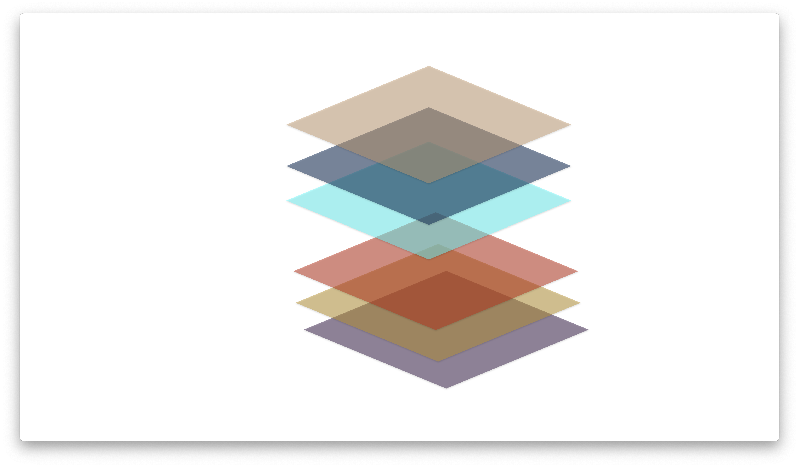
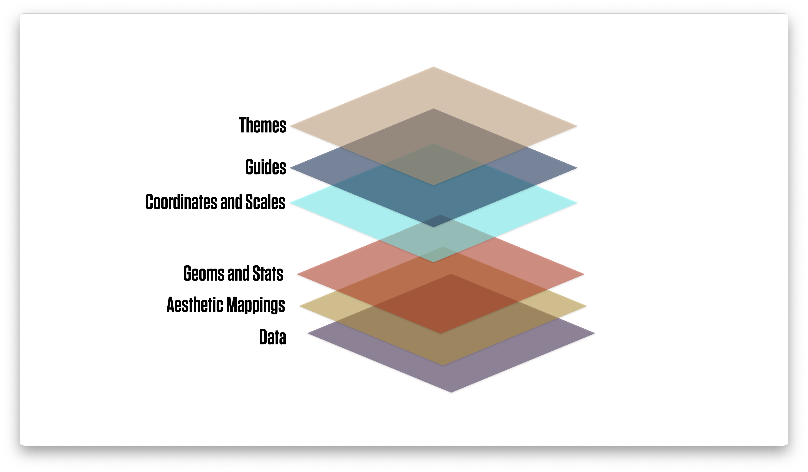

```{r packages, include=FALSE}
library(flipbookr)
library(here)
library(tidyverse)
library(kjhslides)
```


```{r setup, include=FALSE}

kjh_register_tenso()
kjh_set_knitr_opts()
kjh_set_slide_theme()
kjh_set_xaringan_opts()


# Safe
```

class: center middle main-title section-title-1

# .kjh-yellow[Extend your]<br /> .kjh-lblue[`ggplot`] <br /> .kjh-yellow[vocabulary]

.class-info[

**Week 06**

.light[Kieran Healy<br>
Duke University, Spring 2023]

]

---

layout: true
class: title title-1

---

# Load our libraries

.SMALL[
```{r 05-work-with-dplyr-and-geoms-1, message = TRUE}
library(here)      # manage file paths
library(socviz)    # data and some useful functions
library(tidyverse) # your friend and mine
```
]

---

# Tidyverse components, again

.pull-left.w45[

- .kjh-green[**`library`**]`(tidyverse)`
- `Loading tidyverse: ggplot2`
- `Loading tidyverse: tibble`
- `Loading tidyverse: tidyr`
- `Loading tidyverse: readr`
- `Loading tidyverse: purrr`
- `Loading tidyverse: dplyr`
]

--

.pull-right.w55[
- Call the package and ...
- `<|` **Draw graphs**
- `<|` **Nicer data tables**
- `<|` **Tidy your data**
- `<|` **Get data into R**
- `<|` **Fancy Iteration**
- `<|` **Action verbs for tables**

]

---


# Other tidyverse components

.top[.pull-left.w15[   
- `forcats`
- `haven`
- `lubridate`
- `readxl`
- `stringr`
- `reprex`
]]

--

.top[.pull-right.w85[
- `<|` **Deal with factors**
- `<|` **Import Stata, SPSS, etc**
- `<|` **Dates, Durations, Times**
- `<|` **Import from spreadsheets**
- `<|` **Strings and Regular Expressions**
- `<|` **Make reproducible examples**
]]

--
.left.bottom[.footnote[Not all of these are attached when we do `library(tidyverse)`]]


---
layout: false
class: main-title main-title-inv center middle 


.center[]

---

class: main-title main-title-inv center middle 

.center[]


---

class: main-title main-title-inv center middle 

.center[]


---

class: main-title main-title-inv center middle 

.center[]


---

layout: true
class: title title-1

---

class: center middle main-title section-title-1

# .huge[.kjh-yellow[Feeding data]<br /> .kjh-lblue[to `ggplot`]]

---

layout: false
class: center middle

## .middle.huge.squish4[.kjh-orange[Transform and summarize first.]<br />.kjh-lblue[Then send your clean tables to ggplot.]]

---

layout: true
class: title title-1

---

class: center middle main-title section-title-1

# .huge[.kjh-lblue[Extend your] .kjh-yellow[`ggplot` vocabulary]]


---

# We'll move forward in three ways

## .kjh-lblue[Learn more geoms] 

- .kjh-green[`geom_point()`], .kjh-green[`geom_line()`], .kjh-green[`geom_col()`],  .kjh-green[`geom_histogram()`], .kjh-green[`geom_density()`], .kjh-green[`geom_jitter()`], 
.kjh-green[`geom_boxplot()`], .kjh-green[`geom_pointrange()`],...

--

## .kjh-lblue[Learn more about scales, guides, and themes] 

- Functions that control the details of representing data and styling our plots.

--

## .kjh-lblue[Learn more about extensions to ggplot]

- Packages that enhance .kjh-lblue[`ggplot`]'s capabilities, usually by adding support for new kinds of plot (i.e., new geoms), or new functionality (e.g., the .kjh-lblue[`scales`] package).

---

class: right bottom main-title section-title-1

## .huge.right.bottom.squish4[.kjh-yellow[Some data on]<br />.kjh-lblue[Organ Donation]]

---
# .kjh-pink[`organdata`] is in the .kjh-lblue[`socviz`] package

```{r 05-work-with-dplyr-and-geoms-37 }
organdata
```

---

# First looks

```{r 05-work-with-dplyr-and-geoms-38, fig.width=10, fig.height=6}
p <- ggplot(data = organdata,
            mapping = aes(x = year, y = donors))
p + geom_point()
```

---

# First looks

```{r 05-work-with-dplyr-and-geoms-39, fig.width=10, fig.height=6}
p <- ggplot(data = organdata,
            mapping = aes(x = year, y = donors))
p + geom_line() 
```

---

# First looks

```{r 05-work-with-dplyr-and-geoms-40, fig.width=10, fig.height=6}
p <- ggplot(data = organdata,
            mapping = aes(x = year, y = donors))
p + geom_line(aes(group = country)) 
```


---

# First looks

```{r 05-work-with-dplyr-and-geoms-41a, fig.width=21, fig.height=8}
p <- ggplot(data = organdata,
            mapping = aes(x = year, y = donors))
p + geom_line() + 
  facet_wrap(~ country, nrow = 3)
```

---

# First looks

```{r 05-work-with-dplyr-and-geoms-41b, fig.width=21, fig.height=8}
p <- ggplot(data = organdata,
            mapping = aes(x = year, y = donors))
p + geom_line() + 
  facet_wrap(~ reorder(country, donors, na.rm = TRUE), nrow = 3)
```

---

# First looks

```{r 05-work-with-dplyr-and-geoms-41c, fig.width=21, fig.height=8}
p <- ggplot(data = organdata,
            mapping = aes(x = year, y = donors))
p + geom_line() + 
  facet_wrap(~ reorder(country, -donors, na.rm = TRUE), nrow = 3)
```


---


class: right bottom main-title section-title-1

## .huge.right.bottom.squish4[.kjh-yellow[Showing continuous measures] .kjh-lblue[by category]]

---

# Boxplots: .kjh-green[`geom_boxplot()`]

```{r 05-work-with-dplyr-and-geoms-42, fig.width = 15, fig.height=5}
## Pipeline the data directly; then it's implicitly the first argument to `ggplot()`
organdata |> 
  ggplot(mapping = aes(x = country, y = donors)) + 
  geom_boxplot()
```

---

# Put categories on the y-axis!

```{r 05-work-with-dplyr-and-geoms-43, fig.width=10, fig.height=6}
organdata |> 
  ggplot(mapping = aes(x = donors, y = country)) + #<<
  geom_boxplot() +
  labs(y = NULL)
```

---

# Reorder y by the mean of x

```{r 05-work-with-dplyr-and-geoms-44, fig.width=10, fig.height=6}
organdata |> 
  ggplot(mapping = aes(x = donors, y = reorder(country, donors, na.rm = TRUE))) + #<<
  geom_boxplot() +
  labs(y = NULL)
```

---

# (Reorder y by any statistic you like)

```{r 05-work-with-dplyr-and-geoms-45, fig.width=10, fig.height=6}
organdata |> 
  ggplot(mapping = aes(x = donors, y = reorder(country, donors, sd, na.rm = TRUE))) + #<<
  geom_boxplot() +
  labs(y = NULL)
```

---

# .kjh-green[geom_boxplot()] knows .kjh-orange[`color`] and .kjh-orange[`fill`]

```{r 05-work-with-dplyr-and-geoms-46, fig.width=10, fig.height=6}
organdata |> 
  ggplot(mapping = aes(x = donors, y = reorder(country, donors, na.rm = TRUE), fill = world)) + #<<
  geom_boxplot() +
  labs(y = NULL)
```


---

# These strategies are quite general

```{r 05-work-with-dplyr-and-geoms-47, fig.width=10, fig.height=5.5}
organdata |> 
  ggplot(mapping = aes(x = donors, y = reorder(country, donors, na.rm = TRUE), color = world)) + 
  geom_point(size = rel(3)) + #<<
  labs(y = NULL)
```


---

# .kjh-green[geom-jitter()] can help with overplotting

```{r 05-work-with-dplyr-and-geoms-48, fig.width=10, fig.height=6}
organdata |> 
  ggplot(mapping = aes(x = donors, y = reorder(country, donors, na.rm = TRUE), color = world)) + 
  geom_jitter(size = rel(3)) + #<<
  labs(y = NULL)
```

---

# Adjust with a .kjh-orange[`position`] argument

```{r 05-work-with-dplyr-and-geoms-49, fig.width=10, fig.height=6}
organdata |> 
  ggplot(mapping = aes(x = donors, y = reorder(country, donors, na.rm = TRUE),
                       color = world)) + 
  geom_jitter(size = rel(3), position = position_jitter(height = 0.1)) + #<<
  labs(y = NULL)
```

---

# Using .kjh-green[`across()`] and .kjh-green[`where()`] 

```{r 05-work-with-dplyr-and-geoms-52 }
by_country <- organdata |> 
  group_by(consent_law, country) |>
    summarize(across(where(is.numeric),
                     list(mean = ~ mean(.x, na.rm = TRUE), 
                          sd = ~ sd(.x, na.rm = TRUE))), 
              .groups = "drop") #<<
head(by_country)              
              
```

---

# Plot our summary data


.pull-left.w45[
```{r codefig-consent1, message=FALSE, fig.show="hide", fig.width=8, fig.height=5}
by_country |> 
  ggplot(mapping = 
           aes(x = donors_mean, 
               y = reorder(country, donors_mean),
               color = consent_law)) + 
  geom_point(size=3) +
  labs(x = "Donor Procurement Rate",
       y = NULL, 
       color = "Consent Law")
```
]

--

.pull-right.w55[
```{r 05-work-with-dplyr-and-geoms-53, echo=FALSE}
  knitr::include_graphics(
  knitr::fig_chunk("codefig-consent1", "png"))

```

]


---

# What about faceting it instead?

.pull-left.w45[

```{r codefig-consent2, message=FALSE, fig.show="hide", fig.width=8, fig.height=5}
by_country |> 
  ggplot(mapping = 
           aes(x = donors_mean, 
               y = reorder(country, donors_mean),
               color = consent_law)) + 
  geom_point(size=3) +
  guides(color = "none") +
  facet_wrap(~ consent_law) + #<<
  labs(x = "Donor Procurement Rate",
       y = NULL, 
       color = "Consent Law")
```

.pull-left.w80[The problem is that countries can only be in one Consent Law category.]

]

--

.pull-right.w55[
```{r 05-work-with-dplyr-and-geoms-54, echo=FALSE}
  knitr::include_graphics(
  knitr::fig_chunk("codefig-consent2", "png"))
```
]


---

# What about faceting it instead?

.pull-left.w45[
```{r codefig-consent2a, message=FALSE, fig.show="hide", fig.width=5, fig.height=9}
by_country |> 
  ggplot(mapping = 
           aes(x = donors_mean, 
               y = reorder(country, donors_mean),
               color = consent_law)) + 
  geom_point(size=3) +
  guides(color = "none") +
  facet_wrap(~ consent_law, ncol = 1) + #<<
  labs(x = "Donor Procurement Rate",
       y = NULL, 
       color = "Consent Law")
```

.pull-left.w80[Restricting to one column doesn't fix it.]

]


--

.pull-right.w55[
```{r 05-work-with-dplyr-and-geoms-55, echo=FALSE}
  knitr::include_graphics(
  knitr::fig_chunk("codefig-consent2a", "png"))
```
]


---

# Allow the y-scale to vary

.pull-left.w45[
```{r codefig-consent3, message=FALSE, fig.show="hide", fig.width=8, fig.height=6}
by_country |> 
  ggplot(mapping = 
           aes(x = donors_mean, 
               y = reorder(country, donors_mean),
               color = consent_law)) + 
  geom_point(size=3) +
  guides(color = "none") +
  facet_wrap(~ consent_law, 
             ncol = 1,
             scales = "free_y") +  #<<
  labs(x = "Donor Procurement Rate",
       y = NULL, 
       color = "Consent Law")
```

.pull.left.w90[Normally the point of a facet is to preserve comparability between panels by not allowing the scales to vary. But for categorical measures it can be useful to allow this.]

]


--

.pull-right.w55[
```{r 05-work-with-dplyr-and-geoms-56, echo=FALSE}
  knitr::include_graphics(
  knitr::fig_chunk("codefig-consent3", "png"))
```
]

---

# Again, these methods are general

.pull-left.w50[
```{r codefig-consent4, message=FALSE, fig.show="hide", fig.width=8, fig.height=6}
by_country |> 
  ggplot(mapping = 
           aes(x = donors_mean, 
               y = reorder(country, donors_mean),
               color = consent_law)) + 
  geom_pointrange(mapping = #<<
                    aes(xmin = donors_mean - donors_sd, #<<
                        xmax = donors_mean + donors_sd)) + #<<
  guides(color = "none") +
  facet_wrap(~ consent_law, 
             ncol = 1,
             scales = "free_y") +  
  labs(x = "Donor Procurement Rate",
       y = NULL, 
       color = "Consent Law")
```
]

--

.pull-right.w50[
```{r 05-work-with-dplyr-and-geoms-57, echo=FALSE}
  knitr::include_graphics(
  knitr::fig_chunk("codefig-consent4", "png"))
```
]

---

class: right bottom main-title section-title-1

## .huge.right.bottom.squish4.kjh-yellow[Plot text directly]

---

# .kjh-green[`geom_text()`] for basic labels


.pull-left.w45[
```{r codefig-geomtext, message=FALSE, fig.show="hide", fig.width=4.8, fig.height=4.5}

by_country |> 
  ggplot(mapping = aes(x = roads_mean, 
                       y = donors_mean)) + 
  geom_text(mapping = aes(label = country))

```
]

--

.pull-right.w55[
```{r 05-work-with-dplyr-and-geoms-58, echo=FALSE}
  knitr::include_graphics(
  knitr::fig_chunk("codefig-geomtext", "png"))
```
]


---

# It's not very flexible


.pull-left.w45[
```{r codefig-geomtext2, message=FALSE, fig.show="hide", fig.width=4.8, fig.height=4.5}

by_country |> 
  ggplot(mapping = aes(x = roads_mean, 
                       y = donors_mean)) + 
  geom_point() + 
  geom_text(mapping = aes(label = country),
            hjust = 0)


```
]

--

.pull-right.w55[
```{r 05-work-with-dplyr-and-geoms-59, echo=FALSE}
  knitr::include_graphics(
  knitr::fig_chunk("codefig-geomtext2", "png"))
```
]

---

# There are tricks, but they're limited


.pull-left.w45[
```{r codefig-geomtext3, message=FALSE, fig.show="hide", fig.width=4.8, fig.height=4.5}

by_country |> 
  ggplot(mapping = aes(x = roads_mean, 
                       y = donors_mean)) + 
  geom_point() + 
  geom_text(mapping = aes(x = roads_mean + 2, 
                          label = country),
            hjust = 0)


```
]

--

.pull-right.w55[
```{r 05-work-with-dplyr-and-geoms-60, echo=FALSE}
  knitr::include_graphics(
  knitr::fig_chunk("codefig-geomtext3", "png"))
```
]

---

# We'll use .kjh-lblue[`ggrepel`] instead

### The .kjh-lblue[`ggrepel`] package provides .kjh-green[`geom_text_repel()`] and .kjh-green[`geom_label_repel()`]

---

class: right bottom main-title section-title-1

## .huge.right.bottom.squish4.kjh-yellow[U.S. Historic<br/>Presidential Elections]

---

# .kjh-pink[`elections_historic`] is in .kjh-orange[`socviz`] 

```{r 05-work-with-dplyr-and-geoms-61 }
elections_historic
```

---

# We'll draw a plot like this

.center[]


---

# Keep things neat

```{r 05-work-with-dplyr-and-geoms-62 }
## The packages we'll use in addition to ggplot
library(ggrepel) #<<
library(scales) #<<

p_title <- "Presidential Elections: Popular & Electoral College Margins"
p_subtitle <- "1824-2016"
p_caption <- "Data for 2016 are provisional."
x_label <- "Winner's share of Popular Vote"
y_label <- "Winner's share of Electoral College Votes"
```

---

# Base Layer, Lines, Points


.pull-left.w45[
```{r codefig-presplot1, message=FALSE, fig.show="hide", fig.width=5, fig.height=4.5}
p <- ggplot(data = elections_historic, 
            mapping = aes(x = popular_pct, 
                          y = ec_pct,
                          label = winner_label))

p + geom_hline(yintercept = 0.5, 
               size = 1.4, 
               color = "gray80") +
    geom_vline(xintercept = 0.5, 
               size = 1.4, 
               color = "gray80") +
    geom_point()

```
]

--

.pull-right.w55[
```{r 05-work-with-dplyr-and-geoms-63, echo=FALSE}
  knitr::include_graphics(
  knitr::fig_chunk("codefig-presplot1", "png"))
```
]

---

# Add the labels


.pull-left.w45[
```{r codefig-presplot2, message=FALSE, fig.show="hide", fig.width=5, fig.height=4.5}
p <- ggplot(data = elections_historic, 
            mapping = aes(x = popular_pct, 
                          y = ec_pct,
                          label = winner_label))

p + geom_hline(yintercept = 0.5, 
               size = 1.4, color = "gray80") +
  geom_vline(xintercept = 0.5, 
             size = 1.4, color = "gray80") +
  geom_point() + 
  geom_text_repel()

```

.pull-left.w85[This looks messy because .kjh-green[`geom_text_repel()`] uses the dimensions of the available graphics device to iteratively figure out the labels. Let's allow it to draw on the whole slide.]

]

--

.pull-right.w55[
```{r 05-work-with-dplyr-and-geoms-64, echo=FALSE}
  knitr::include_graphics(
  knitr::fig_chunk("codefig-presplot2", "png"))
```
]

---

# The labeling is with respect to the plot size

```{r 05-work-with-dplyr-and-geoms-65 }
p <- ggplot(data = elections_historic, 
            mapping  = aes(x = popular_pct, 
                           y = ec_pct,
                           label = winner_label))

p_out <- p + 
  geom_hline(yintercept = 0.5, 
             size = 1.4, 
             color = "gray80") +
  geom_vline(xintercept = 0.5, 
             size = 1.4, 
             color = "gray80") +
  geom_point() + 
  geom_text_repel() #<<

```

---

layout:false
class: middle center

```{r 05-work-with-dplyr-and-geoms-66, echo = FALSE, fig.width=15, fig.height=8.5}
p_out
```

---

layout: true
class: title title-1

---

# Adjust the Scales

```{r 05-work-with-dplyr-and-geoms-67 }
p <- ggplot(data = elections_historic, 
            mapping  = aes(x = popular_pct, 
                           y = ec_pct,
                           label = winner_label))
p_out <- p + geom_hline(yintercept = 0.5, 
                        size = 1.4, 
                        color = "gray80") +
    geom_vline(xintercept = 0.5, 
               size = 1.4, 
               color = "gray80") +
    geom_point() +
    geom_text_repel() +
    scale_x_continuous(labels = label_percent()) + #<<
    scale_y_continuous(labels = label_percent()) #<<
```

---

layout:false
class: middle center

```{r 05-work-with-dplyr-and-geoms-68, echo = FALSE, fig.width=15, fig.height=8.5}
p_out
```

---

layout: true
class: title title-1

---

# Add the labels

```{r 05-work-with-dplyr-and-geoms-69 }
p <- ggplot(data = elections_historic, 
            mapping  = aes(x = popular_pct, 
                           y = ec_pct,
                           label = winner_label))
p_out <- p + geom_hline(yintercept = 0.5, 
                        size = 1.4, 
                        color = "gray80") +
  geom_vline(xintercept = 0.5, 
             size = 1.4, 
             color = "gray80") +
  geom_point() +
  geom_text_repel(mapping = aes(family = "Tenso Slide")) +#<<
  scale_x_continuous(labels = label_percent()) +
  scale_y_continuous(labels = label_percent()) +
  labs(x = x_label, y = y_label,  #<<
       title = p_title, 
       subtitle = p_subtitle,
       caption = p_caption)   
  
  
  
```


---

layout:false
class: middle center

```{r 05-work-with-dplyr-and-geoms-70, echo = FALSE, fig.width=15, fig.height=8.5}
p_out
```

---

class: right bottom main-title section-title-1

## .huge.right.bottom.squish4[.kjh-yellow[Labeling points<br />of interest]]

---

layout: true
class: title title-1

---


# Option 1: On the fly inside .kjh-lblue[`ggplot`]


.pull-left.w50[
```{r codefig-subset1, message=FALSE, fig.show="hide", fig.width=4.8, fig.height=4.5}
by_country |> 
  ggplot(mapping = aes(x = gdp_mean,
                       y = health_mean)) +
  geom_point() + 
  geom_text_repel(data = subset(by_country, gdp_mean > 25000), 
                  mapping = aes(label = country))


```
]

--

.pull-right.w50[
```{r 05-work-with-dplyr-and-geoms-71, echo=FALSE}
  knitr::include_graphics(
  knitr::fig_chunk("codefig-subset1", "png"))
```
]

---

# Option 1: On the fly inside .kjh-lblue[`ggplot`]


.pull-left.w50[
```{r codefig-subset2, message=FALSE, fig.show="hide", fig.width=4.8, fig.height=4.5}

by_country |> 
  ggplot(mapping = aes(x = gdp_mean,
                       y = health_mean)) +
  geom_point() + 
  geom_text_repel(data = subset(by_country, 
                                gdp_mean > 25000 |
                                  health_mean < 1500 |
                                  country %in% "Belgium"), 
                  mapping = aes(label = country))


```

.pull-left.w90[Stuffing everything into the .kjh-green[`subset()`] call might get messy]

]

--

.pull-right.w50[
```{r 05-work-with-dplyr-and-geoms-72, echo=FALSE}
  knitr::include_graphics(
  knitr::fig_chunk("codefig-subset2", "png"))
```
]

---

# Option 2: Use .kjh-lblue[`dplyr`] to subset first


```{r 05-work-with-dplyr-and-geoms-73 }
df_hl <- by_country |> 
  filter(gdp_mean > 25000 | 
           health_mean < 1500 | 
           country %in% "Belgium")

df_hl
```

---

# Option 2: Use .kjh-lblue[`dplyr`] to subset first


```{r 05-work-with-dplyr-and-geoms-74 }
df_hl <- by_country |> 
  filter(gdp_mean > 25000 | 
           health_mean < 1500 | 
           country %in% "Belgium")

df_hl
```

---


# Option 2: Use .kjh-lblue[`dplyr`] to subset first


.pull-left.w50[
```{r codefig-subset3, message=FALSE, fig.show="hide", fig.width=4.8, fig.height=4.5}

by_country |> 
  ggplot(mapping = aes(x = gdp_mean,
                       y = health_mean)) +
  geom_point() + 
  geom_text_repel(data = df_hl, 
                  mapping = aes(label = country))


```

.pull-left.w90[This makes things a little neater.

As you can see, a `geom` can be fully "autonomous". Each one can have its own .kjh-orange[`mapping`] call _and_ its own .kjh-orange[`data`] source. This can be very useful when building up plots overlaying several sources or subsets of data.
]

]

--

.pull-right.w50[
```{r 05-work-with-dplyr-and-geoms-75, echo=FALSE}
  knitr::include_graphics(
  knitr::fig_chunk("codefig-subset3", "png"))
```
]

---

class: right bottom main-title section-title-1

## .huge.right.bottom.squish4[.kjh-yellow[Write and draw]<br>.kjh-lblue[inside the plot area]]

---

layout: true
class: title title-1

---

# .kjh-green[`annotate()`] can imitate geoms


.pull-left.w50[
```{r codefig-annotate1, message=FALSE, fig.show="hide", fig.width=4.8, fig.height=4.5}

organdata |> 
  ggplot(mapping = aes(x = roads, 
                       y = donors)) + 
  geom_point() + 
  annotate(geom = "text", 
           family = "Tenso Slide",
           x = 157, 
           y = 33,
           label = "A surprisingly high \n recovery rate.",
           hjust = 0)

```
]

--

.pull-right.w50[
```{r 05-work-with-dplyr-and-geoms-76, echo=FALSE}
  knitr::include_graphics(
  knitr::fig_chunk("codefig-annotate1", "png"))
```
]

---

# .kjh-green[`annotate()`] can imitate geoms


.pull-left.w50[
```{r codefig-annotate2, message=FALSE, fig.show="hide", fig.width=4.8, fig.height=4.5}

organdata |> 
  ggplot(mapping = aes(x = roads, 
                       y = donors)) + 
  geom_point() +
  annotate(geom = "rect", 
           xmin = 125, xmax = 155,
           ymin = 30, ymax = 35,
           fill = "red", 
           alpha = 0.2) + 
  annotate(geom = "text", 
           x = 157, y = 33,
           family = "Tenso Slide",
           label = "A surprisingly high \n recovery rate.", 
           hjust = 0)

```
]

--

.pull-right.w50[
```{r 05-work-with-dplyr-and-geoms-77, echo=FALSE}
  knitr::include_graphics(
  knitr::fig_chunk("codefig-annotate2", "png"))
```
]


---

class: center middle main-title section-title-1

# .huge[.kjh-lblue[Scales, Guides, Themes]]

---

layout: true
class: title title-1

---

# Every .kjh-lblue[mapped variable] has a .kjh-orange[scale]

### Aesthetic mappings link quantities or categories in your data to things you can see on the graph. Thus, they have a  scale associated with that representation.

### Scale functions manage this relationship. Remember: not just `x` and `y` but also `color`, `fill`, `shape`, `size`, and `alpha` are scales.

- If it can represent your data, it has a scale, and a _scale function_ to manage it.

### This means you control things like color schemes _for data mappings_ through scale functions

- Because those colors are representing features of your data.

---

# Naming conventions for scale functions

- In general, scale functions are named like this:

- .center.large[.kjh-green[`scale\\\_`].kjh-orange[`<MAPPING>`].kjh-green[`\\\_`].kjh-lblue[`<KIND>`].kjh-green[`()`]]


- .large[We already know there are a lot of .kjh-orange[**mappings**]]. 
- .right[_.kjh-orange[`x`], .kjh-orange[`y`], .kjh-orange[`color`], .kjh-orange[`size`], .kjh-orange[`shape`], and so on._] 

- .large[And there are many .kjh-lblue[**kinds**] of scale as well.] 
- .right[_.kjh-lblue[discrete], .kjh-lblue[continuous], .kjh-lblue[log10], .kjh-lblue[date], .kjh-lblue[binned], and many others._]

- .large[So there's a whole zoo of scale functions.]
- .right[_The naming convention helps us keep track._]


---

# Naming conventions for scale functions

- .large.center[.kjh-green[`scale\\\_`].kjh-orange[`mapping`].kjh-green[`\\\_`].kjh-lblue[`kind`].kjh-green[`()`]]

- .center[.kjh-green[`scale\\\_`].kjh-orange[`x`].kjh-green[`\\\_`].kjh-lblue[`continuous`].kjh-green[`()`]]

- .center[.kjh-green[`scale\\\_`].kjh-orange[`y`].kjh-green[`\\\_`].kjh-lblue[`continous`].kjh-green[`()`]]

- .center[.kjh-green[`scale\\\_`].kjh-orange[`x`].kjh-green[`\\\_`].kjh-lblue[`discrete`].kjh-green[`()`]]

- .center[.kjh-green[`scale\\\_`].kjh-orange[`y`].kjh-green[`\\\_`].kjh-lblue[`discrete`].kjh-green[`()`]]

- .center[.kjh-green[`scale\\\_`].kjh-orange[`x`].kjh-green[`\\\_`].kjh-lblue[`log10`].kjh-green[`()`]]

- .center[.kjh-green[`scale\\\_`].kjh-orange[`x`].kjh-green[`\\\_`].kjh-lblue[`sqrt`].kjh-green[`()`]]


---

# Naming conventions for scale functions

- .large.center[.kjh-green[`scale\\\_`].kjh-orange[`mapping`].kjh-green[`\\\_`].kjh-lblue[`kind`].kjh-green[`()`]]

- .center[.kjh-green[`scale\\\_`].kjh-orange[`color`].kjh-green[`\\\_`].kjh-lblue[`discrete`].kjh-green[`()`]]

- .center[.kjh-green[`scale\\\_`].kjh-orange[`color`].kjh-green[`\\\_`].kjh-lblue[`gradient`].kjh-green[`()`]]

- .center[.kjh-green[`scale\\\_`].kjh-orange[`color`].kjh-green[`\\\_`].kjh-lblue[`gradient2`].kjh-green[`()`]]

- .center[.kjh-green[`scale\\\_`].kjh-orange[`color`].kjh-green[`\\\_`].kjh-lblue[`brewer`].kjh-green[`()`]]

- .center[.kjh-green[`scale\\\_`].kjh-orange[`fill`].kjh-green[`\\\_`].kjh-lblue[`discrete`].kjh-green[`()`]]

- .center[.kjh-green[`scale\\\_`].kjh-orange[`fill`].kjh-green[`\\\_`].kjh-lblue[`gradient`].kjh-green[`()`]]

- .center[.kjh-green[`scale\\\_`].kjh-orange[`fill`].kjh-green[`\\\_`].kjh-lblue[`gradient2`].kjh-green[`()`]]

- .center[.kjh-green[`scale\\\_`].kjh-orange[`fill`].kjh-green[`\\\_`].kjh-lblue[`brewer`].kjh-green[`()`]]

---

# Scale functions in practice

- Scale functions take arguments appropriate to their mapping and kind


.pull-left.w50[
```{r codefig-scalefn1, message=FALSE, fig.show="hide", fig.width=4.8, fig.height=4.5}

organdata |> 
  ggplot(mapping = aes(x = roads,
                       y = donors,
                       color = world)) + 
  geom_point() +
  scale_y_continuous(breaks = c(5, 15, 25),
                     labels = c("Five", 
                                "Fifteen", 
                                "Twenty Five"))

```
]

--

.pull-right.w50[
```{r 05-work-with-dplyr-and-geoms-78, echo=FALSE}
  knitr::include_graphics(
  knitr::fig_chunk("codefig-scalefn1", "png"))
```
]

---

# More usefully ...


.pull-left.w50[
```{r codefig-scalecolordiscrete, message=FALSE, fig.show="hide", fig.width=4.8, fig.height=4.5}

organdata |> 
  ggplot(mapping = aes(x = roads,
                       y = donors,
                       color = world)) + 
  geom_point() +
  scale_color_discrete(labels =
                         c("Corporatist", 
                           "Liberal",
                           "Social Democratic", 
                           "Unclassified")) +
  labs(x = "Road Deaths",
       y = "Donor Procurement",
       color = "Welfare State")

```
]

--

.pull-right.w50[
```{r 05-work-with-dplyr-and-geoms-79, echo=FALSE}
  knitr::include_graphics(
  knitr::fig_chunk("codefig-scalecolordiscrete", "png"))
```
]

---

# The .kjh-green[`guides()`] function

.pull-left.w45[
```{r codefig-guidesfn, message=FALSE, fig.show="hide", fig.width=4.8, fig.height=5.5}

organdata |> 
  ggplot(mapping = aes(x = roads,
                       y = donors,
                       color = consent_law)) + 
  geom_point() +
  facet_wrap(~ consent_law, ncol = 1) +
  guides(color = "none") + 
  labs(x = "Road Deaths",
       y = "Donor Procurement")

```

.pull-left.w90[- Control overall properties of the guide labels.
- Common use: turning it off.
- We'll see more advanced uses later.]

]

--

.pull-right.w50[
```{r 05-work-with-dplyr-and-geoms-80, echo=FALSE}
  knitr::include_graphics(
  knitr::fig_chunk("codefig-guidesfn", "png"))
```
]


---

# The .kjh-green[`theme()`] function

```{r 05-work-with-dplyr-and-geoms-81, echo=FALSE}
kjhslides::kjh_set_classic_theme(4)
```


.pull-left.w45[
```{r codefig-themefn, message=FALSE, fig.show="hide", fig.width=5, fig.height=4.5}
## Using the "classic" ggplot theme here
organdata |> 
  ggplot(mapping = aes(x = roads,
                       y = donors,
                       color = consent_law)) + 
  geom_point() +
  labs(title = "By Consent Law",
    x = "Road Deaths",
    y = "Donor Procurement", 
    color = "Legal Regime:") + 
  theme(legend.position = "bottom", 
        plot.title = element_text(color = "darkred",
                                  face = "bold"))

```

.pull-left.w95[
.kjh-green[`theme()`] styles parts of your plot that are _not_ directly representing your data. Often the first thing people want to adjust; but logically it's the _last_ thing. Again, more detail soon!
]

]

--

.pull-right.w50[
```{r 05-work-with-dplyr-and-geoms-82, echo=FALSE}
  knitr::include_graphics(
  knitr::fig_chunk("codefig-themefn", "png"))
```
]

```{r 05-work-with-dplyr-and-geoms-83, echo=FALSE}
kjhslides::kjh_set_slide_theme()
```


