```{r packages, include=FALSE}
library(flipbookr)
library(here)
library(tidyverse)
library(kjhslides)
```


```{r setup, include=FALSE}

kjh_register_tenso()
kjh_set_knitr_opts()
kjh_set_slide_theme()
kjh_set_xaringan_opts()


# Safe
```

class: center middle main-title section-title-1

# .kjh-yellow[Data and]<br /> .kjh-lblue[the state] 

.class-info[

**Week 07**

.light[Kieran Healy<br>
Duke University, Spring 2023]

]

---

layout: true
class: title title-1

---

# Load our libraries

.SMALL[
```{r 05-work-with-dplyr-and-geoms-1, message = TRUE}
library(here)       # manage file paths
library(socviz)     # data and some useful functions
library(tidyverse)  # your friend and mine
library(tidycensus) # Tidily interact with the US Census
```
]


---

# What is data?

.center[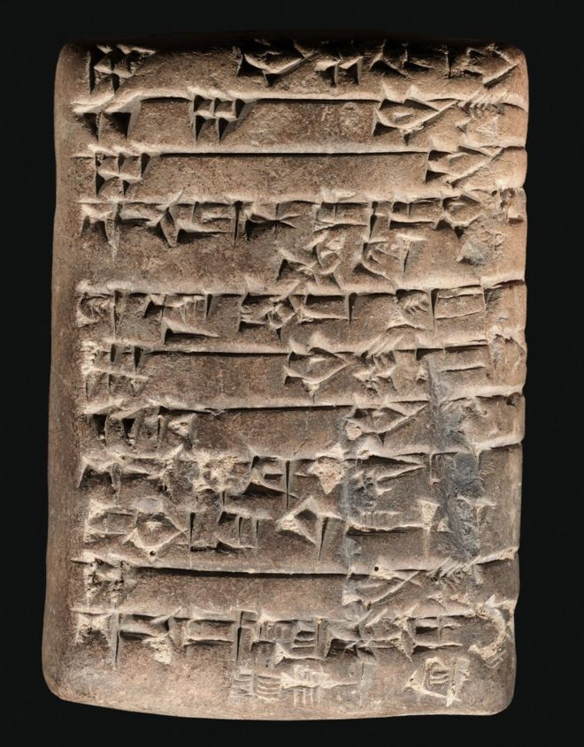]

---

# What is data?

.pull-left.w45[

]

--

## A Trace

--

## A Record

--

## An Account

---

# What is data?

.pull-left.w45[
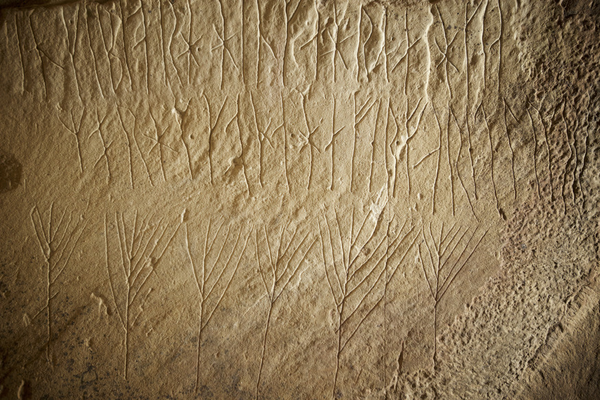
]

--

## A Story

--

## A Memory

--

## A Promise

???

When Maeshowe was first excavated, in 1861, the chamber's original entrance passage was inaccessible. So, to allow access, the excavators drove a shaft down through the top of the mound. Once inside, however, they found proof that that they were not the first to have broken into the tomb. The walls of the Stone Age chamber were covered in with runic graffiti. The 30 inscriptions found in Maeshowe, make it one of the largest, and most famous, collections of runes known in Europe. According to Orkneyinga saga, over 800 years previously, in the darkness of an Orkney winter, a group of viking warriors had sought shelter from a terrible snowstorm. Leading the men was Earl Harald, who, at Christmas, 1153, was making his way from Stromness to the parish of Firth. The Earl's party took refuge in an already ancient structure – the mound they knew as Orkahaugr. Inside, while waiting for the storm to abate, they carved graffiti into the stone walls. What drew these Norsemen to the tomb? Was it the legends of a great treasure that lay within?

---

# What is data?

.pull-left.w45[
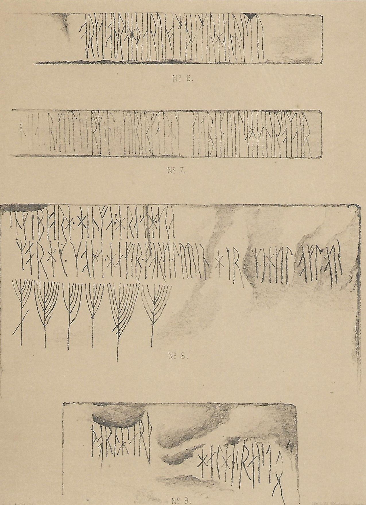
]


## A Story


## A Memory


## A Promise

???

"Ingebjork the fair widow - many a woman has walked stooping in here a very showy person" signed by "Erlingr"
"Thorni f*cked. Helgi carved" (the official guidebooks usually tone this inscription down)
"Ingigerth is the most beautiful of all women" (carved beside a rough drawing of a slavering dog)
"This mound was raised before Ragnarr Lothbrocks her sons were brave smooth-hide men though they were"
Ofram the son of Sigurd carved these runes"
"Haermund Hardaxe carved these runes"
"These runes were carved by the man most skilled in runes in the western ocean"
"Tholfir Kolbeinsson carved these runes high up"
"This howe Vermundr carved"
"Ottarfila carved these runes"


---


# What is data?

.pull-left.w45[
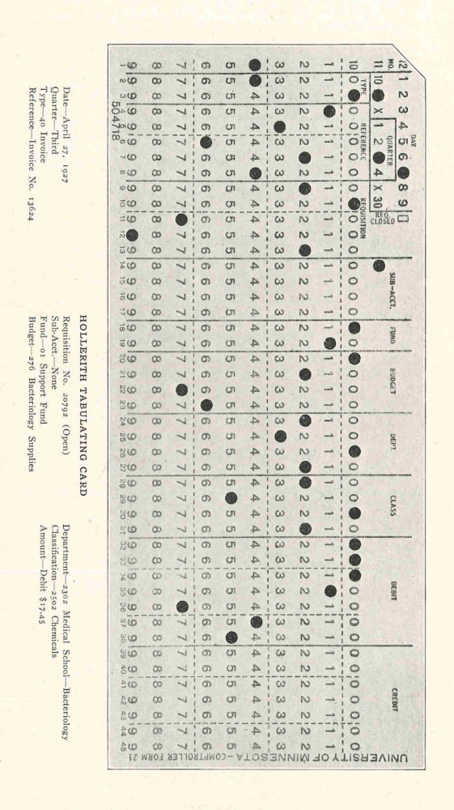
]

--

## A Tool

--

## A Device

--

## A Resource

---

# What is data 

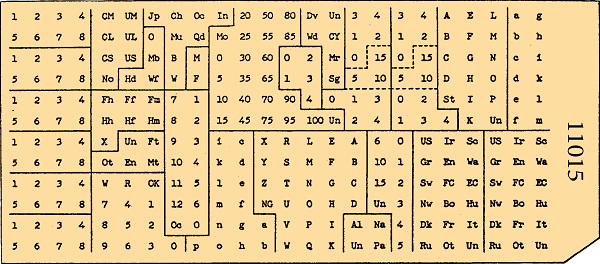
---

# What is data 

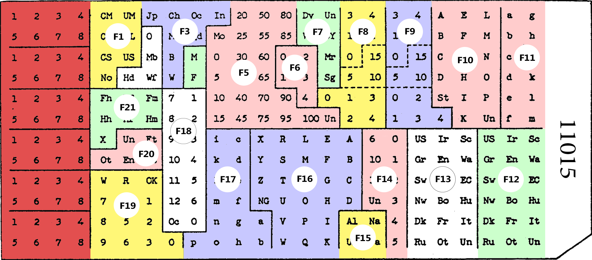

---

# The U.S. Census


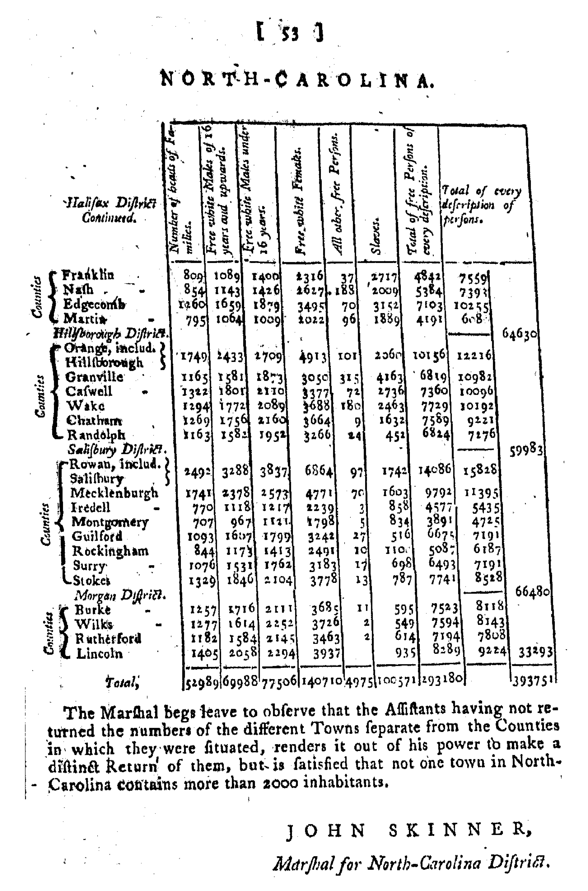


---

# The U.S. Census


---

# The U.S. Census


.pull-left.w45[

## .kjh-lblue[1790]

-  • Number of free white males aged under 16 years
-  • Number of free white males aged 16 years and upward
-  • Number of free white females
-  • Number of other free persons
-  • Number of slaves

]

--

.pull-right.w45[

## .kjh-lblue[1820]

-  • The number of free White males and females
-  • The number of male and female slaves
-  • The number of free colored males and females 
-  • Number of foreigners not naturalized

]

---

# The U.S. Census


.pull-left.w45[

## .kjh-lblue[1830]

-  • The number of slaves and free colored persons of each sex
-  • Number of foreigners not naturalized


## .kjh-orange[1850]

-  • Free Inhabitants Questionnaire
-  • Slave Inhabitants Questionnaire
-  • Individual enslaved people listed by owner and assigned a number; names not recorded

]

--

.pull-right.w45[

## .kjh-green[1860]

-  • “Color” Question, recorded as White, Black, Mulatto, Chinese, Indian

## .kjh-red[1890]

-  • “Race”, recorded as White, Black, Mulatto, Quadroon, Octoroon, Chinese, Japanese, or Indian.

]


---

# The U.S. Census


.pull-left.w45[

## .kjh-lblue[1900]

-  • “Color or Race”, recorded as White, Black, Chinese, Japanese, Indian


## .kjh-orange[1910]

-  • White, Black, Mulatto, Chinese, Japanese, Indian, Other

]

--

.pull-right.w45[

## .kjh-green[1930]

-  "Mexican" a racial category

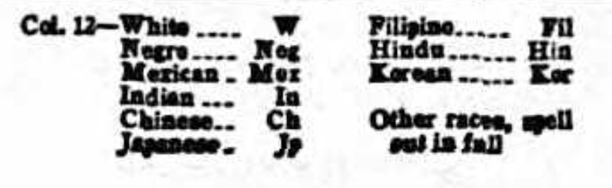

## .kjh-red[1940]

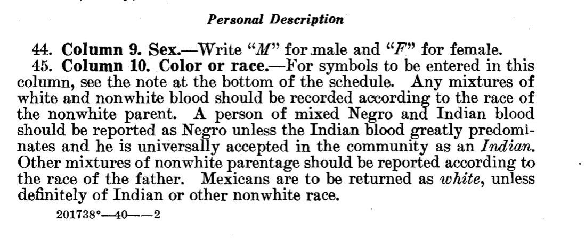


]


---

# The U.S. Census


.pull-left.w45[

## .kjh-lblue[1970]

]

.pull-right.w45[

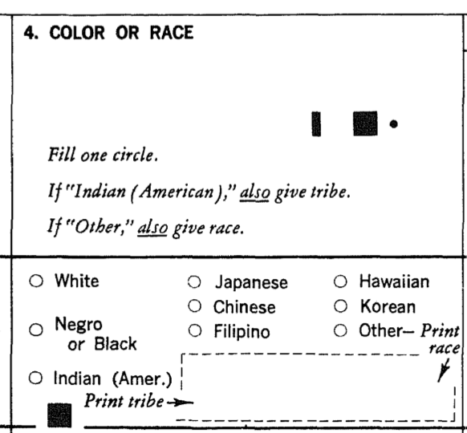

]


---

# The U.S. Census


.pull-left.w45[

## .kjh-lblue[1980]

]

.pull-right.w45[

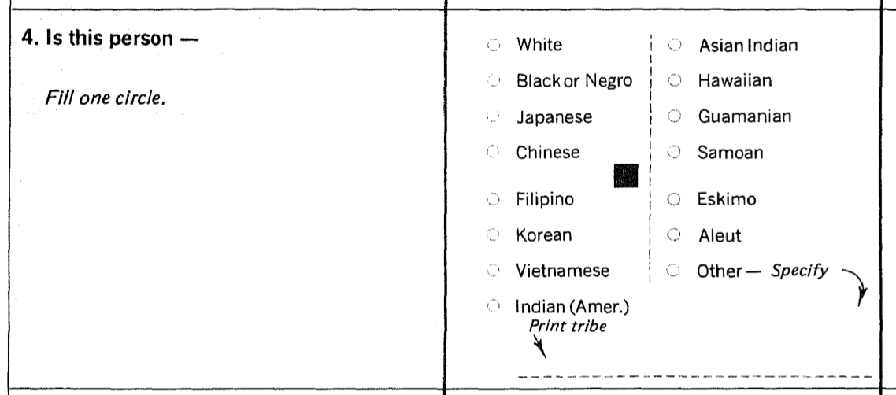

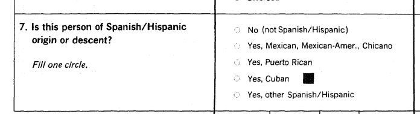


]

---


# The U.S. Census


.pull-left.w45[

## .kjh-lblue[1990]

]

.pull-right.w45[

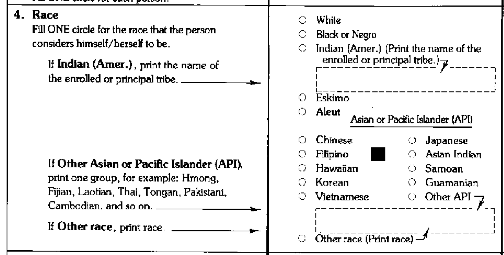

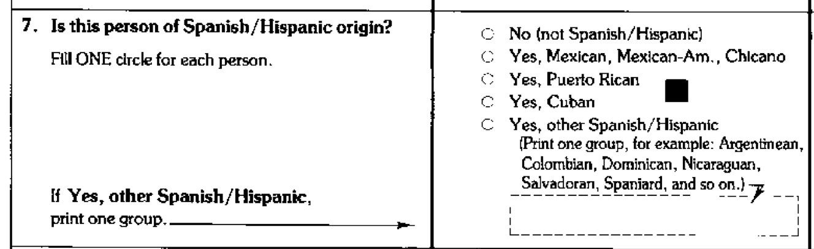


]

---


# The U.S. Census


.pull-left.w45[

## .kjh-lblue[2000]

]

.pull-right.w45[

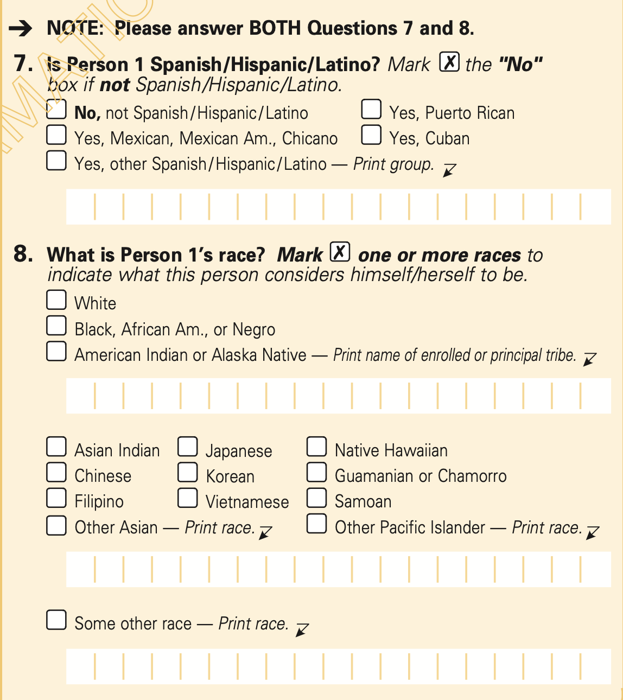
]
---


# The U.S. Census


.pull-left.w45[

## .kjh-lblue[2010]

]

.pull-right.w45[

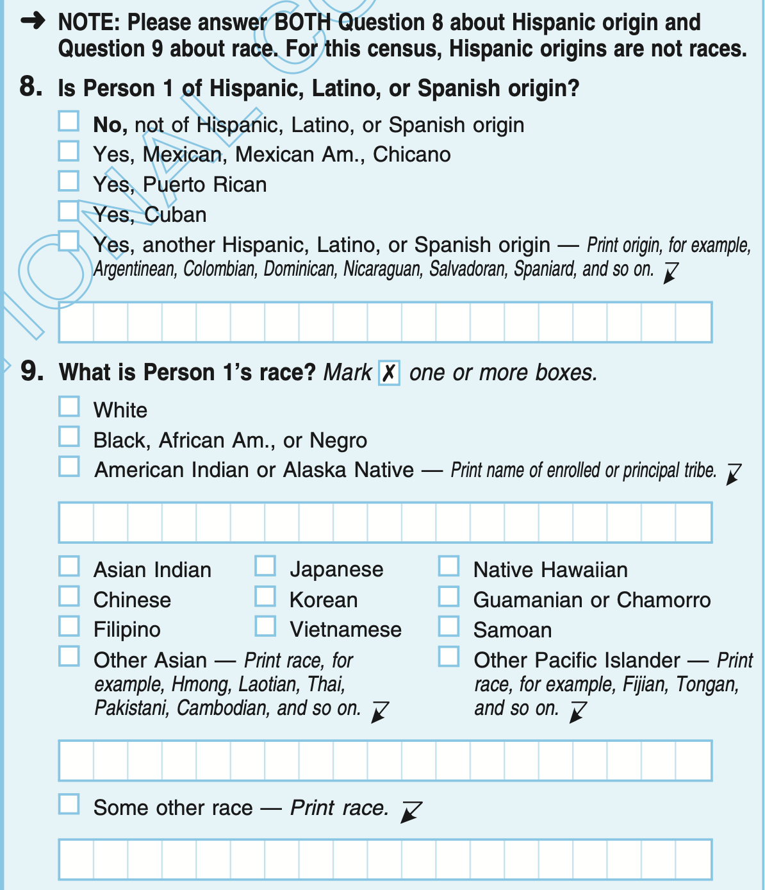

]
---


# The U.S. Census


.pull-left.w45[

## .kjh-lblue[2020]

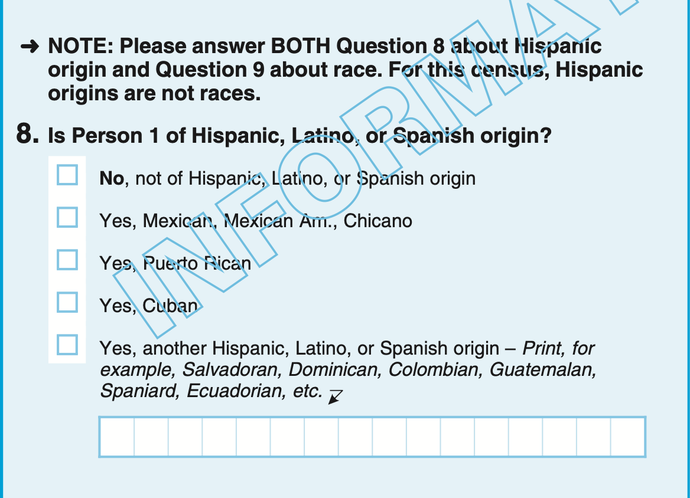

]

.pull-right.w45[


]
