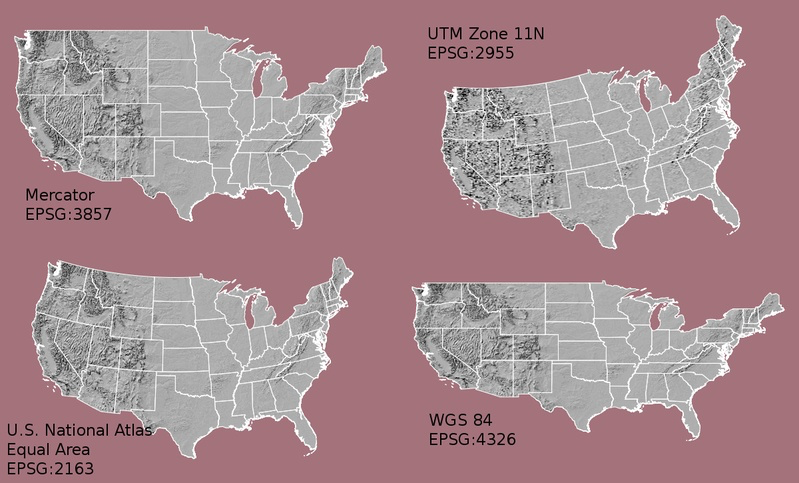

```{r packages, include=FALSE}
library(flipbookr)
library(here)
library(tidyverse)
library(kjhslides)
```


```{r setup, include=FALSE}

kjh_register_tenso()
kjh_set_knitr_opts()
kjh_set_slide_theme()
kjh_set_xaringan_opts()


# Safe
```


class: center middle main-title section-title-1

# .huge[.kjh-lblue[Basic] .kjh-yellow[Maps]]

---

class: right bottom main-title section-title-1

## .huge.right.bottom.squish4[.kjh-yellow[Maps as] .kjh-lblue[polygons]]

---

layout: true
class: title title-1

---

# Packages

```{r}
library(here)       # manage file paths
library(socviz)     # data and some useful functions
library(tidyverse)  # your friend and mine
library(maps)       # Some basic maps
library(ggforce)    # ggplot extensions
```

---

# Take a look at this data

```{r 07-make-maps-6 }
## This is from the map library
# library(maps)

us_states <- map_data("state")

dim(us_states)

## Making it a tibble prevents crashes 
## in the slide rendering later on
us_states <- as_tibble(us_states)

us_states

```

---

# What is this, at root?

```{r 07-make-maps-7 }
us_states

```

- It's a series of rows defining `x` and `y` coordinatates on a plane. 

- If we join those points up as lines while respecting their `group` (i.e. so `ggplot` knows when to "lift the pen", as with the `gapminder` line plot), we will get an outline map of states in the U.S. 

---

# Like this, with .kjh-green[`geom_polygon()`]

.pull-left.w35[
```{r codefig-poly1, message=FALSE, fig.show="hide", fig.width=6, fig.height=4.5}
  
us_states |>
  ggplot(mapping = aes(x = long, 
                       y = lat, 
                       group = group)) +
  geom_polygon(fill = "white", 
               color = "black") +
  labs(title = "This looks horrible")

```
]

--

.pull-right.w65[
```{r 07-make-maps-8, echo=FALSE}
  knitr::include_graphics(
  knitr::fig_chunk("codefig-poly1", "png"))
```
]

---

# We can represent a .kjh-orange[`fill`], too, like any geom


.pull-left.w35[
```{r codefig-poly2, message=FALSE, fig.show="hide", fig.width=6, fig.height=4.5}

us_states |>
  ggplot(mapping = aes(x = long, 
                       y = lat,
                       fill = region,#<<
                       group = group)) +
  geom_polygon(color = "black") + 
  guides(fill = "none") + #<<
  labs(title = "Still looks horrible", 
       caption = "Set fill = none 
         to stop ggplot from 
         producing a key
         with 50 entries")

```
]

--

.pull-right.w65[
```{r 07-make-maps-9, echo=FALSE}
  knitr::include_graphics(
  knitr::fig_chunk("codefig-poly2", "png"))
```
]

---

layout: true
class: title title-1

---

# We need to do two things

### .center.middle.huge[1: Fix the .kjh-lblue[map projection]]

### .center.middle.huge[2: .kjh-orange[Add some data] to fill with.]

---

# For now, we'll do it the direct way

- .middle.large[To make explicit what's happening, and to emphasize how .kjh-pink[_it's all just points and lines made from tables_] we'll first do it at the level of the .kjh-lblue[`ggplot`] grammar with a geom that just draws shapes, .kjh-green[`geom_polygon()`]. After that, we'll introduce a new package, .kjh-lblue[`sf`] and a new geom, .kjh-green[`geom_sf()`] that will handle this for us, and more.]

---

layout: true
class: title title-1

---

`r chunk_reveal("reveal-coord", widths = c(40,60), title = "# Fix the projection")`

```{r reveal-coord, include = FALSE}
us_states <- as_tibble(map_data("state"))

us_states |>
  ggplot(mapping = aes(x = long, 
                       y = lat,
                       fill = region,
                       group = group)) +
  geom_polygon(color = "black") + 
  guides(fill = "none") +
  coord_map(projection = "albers", 
            lat0 = 39, 
            lat1 = 45) 

## A coordinate transformation!

```

---

layout: true
class: title title-1

---

# U.S. Map Projections

.center[]


---

# U.S. Map Projections

.center[]

---
layout: false

```{r 07-make-maps-10, echo = FALSE, fig.height=8, fig.width=15}
us_states |>
  ggplot(mapping = aes(x = long, 
                       y = lat,
                       fill = region,#<<
                       group = group)) +
  geom_polygon(color = "black") + 
  coord_map(projection = "albers", #<
            lat0 = 39,  #<
            lat1 = 45) + #<
  guides(fill = "none")
```


.right.w90.small[Our U.S. Map again, now transformed]

---

layout: true
class: title title-1

---

# Next, some data

.small[- We can merge our state-level `election` data with the `us_states` table, but we need to do a little work.] 

.pull-left.w45[
```{r 07-make-maps-11 }
us_states
```

]

.pull-right.w45[
```{r 07-make-maps-12 }
election
```
]

--

.center[To merge, or .kjh-pink[_join_] these tables, they need to have a column in common to act as a key.]


---

# Recode to make a key

```{r 07-make-maps-13 }
election <- election |>
  mutate(region = tolower(state)) |> 
  relocate(region)

election
```

---

# Now we can join them

.pull-left.w45[
```{r 07-make-maps-14 }
us_states
```

]

.pull-right.w45[
```{r 07-make-maps-15 }
election
```
]

---

# This is a .kjh-pink[_left join_]

```{r 07-make-maps-16 }
us_states_elec <- left_join(us_states, election, by = "region")

us_states_elec
```

--

.center[Now our `us_states_elec` table has both the line-drawing information and (very redundantly) the election data merged in, with rows repeated as necessary.]


---

layout: true
class: title title-1

---

# Now we can start drawing choropleths


.pull-left.w45[
```{r codefig-choroparty, message=FALSE, fig.show="hide", fig.width=4.8, fig.height=4.5}

us_states_elec |>
  ggplot(mapping = aes(x = long, 
                       y = lat,
                       fill = party,#<<
                       group = group)) + 
  geom_polygon(color = "gray90", 
               size = 0.1) +
  coord_map(projection = "albers", 
            lat0 = 39, lat1 = 45) +
  guides(fill = "none")


```
]

.pull-right.w55[
```{r 07-make-maps-17, echo=FALSE}
  knitr::include_graphics(
  knitr::fig_chunk("codefig-choroparty", "png"))
```

]

---

# Let's turn off the gridlines

This is a .kjh-pink[_theme function_].

```{r 07-make-maps-18 }
theme_map <- function(base_size=9, base_family="") {
    require(grid)
    theme_bw(base_size=base_size, base_family=base_family) %+replace%
        theme(axis.line=element_blank(),
              axis.text=element_blank(),
              axis.ticks=element_blank(),
              axis.title=element_blank(),
              panel.background=element_blank(),
              panel.border=element_blank(),
              panel.grid=element_blank(),
              panel.spacing=unit(0, "lines"),
              plot.background=element_blank(),
              legend.justification = c(0,0),
              legend.position = c(0,0)
              )
}
```

---

# Add the theme function at the end

.pull-left.w45[
```{r codefig-choropartytheme, message=FALSE, fig.show="hide", fig.width=4.8, fig.height=4.5}

us_states_elec |> 
  ggplot(mapping = aes(x = long, 
                       y = lat,
                       fill = party,#<<
                       group = group)) + 
  geom_polygon(color = "gray90", 
               size = 0.1) +
  coord_map(projection = "albers", 
            lat0 = 39, lat1 = 45) +
  theme_map()


```
]

.pull-right.w55[
```{r 07-make-maps-19, echo=FALSE}
  knitr::include_graphics(
  knitr::fig_chunk("codefig-choropartytheme", "png"))
```

]

---

# Fix the Party Colors


.pull-left.w45[
```{r codefig-choropartycolors, message=FALSE, fig.show="hide", fig.width=4.8, fig.height=4.5}
  
## Hex color codes for Democratic Blue and Republican Red
party_colors <- c("#2E74C0", "#CB454A")


us_states_elec |> 
  ggplot(mapping = aes(x = long, 
                       y = lat,
                       fill = party,#<<
                       group = group)) + 
  geom_polygon(color = "gray90", 
               size = 0.1) +
  scale_fill_manual(values = party_colors) + 
  coord_map(projection = "albers", 
            lat0 = 39, lat1 = 45) +
  theme_map()

```
]

--

.pull-right.w55[
```{r 07-make-maps-20, echo=FALSE}
  knitr::include_graphics(
  knitr::fig_chunk("codefig-choropartycolors", "png"))
```
]

---

# On maps, continuous measures are _gradients_


.pull-left.w45[
```{r codefig-gradient1, message=FALSE, fig.show="hide", fig.width=4.8, fig.height=4.5}

us_states_elec |> 
  ggplot(mapping = aes(x = long, 
                       y = lat,
                       fill = pct_trump,#<<
                       group = group)) + 
  geom_polygon(color = "gray90", 
               size = 0.1) +
  coord_map(projection = "albers", 
            lat0 = 39, lat1 = 45) +
  labs(title = "Trump vote", 
       fill = "Percent") +  
  theme_map()

```
]

--

.pull-right.w55[
```{r 07-make-maps-21, echo=FALSE}
  knitr::include_graphics(
  knitr::fig_chunk("codefig-gradient1", "png"))
```
]

---

# Fix the gradient scale with its .kjh-orange[scale function]


.pull-left.w45[
```{r codefig-gradient2, message=FALSE, fig.show="hide", fig.width=4.8, fig.height=4.5}

us_states_elec |> 
  ggplot(mapping = aes(x = long, 
                       y = lat,
                       fill = pct_trump,
                       group = group)) + 
  geom_polygon(color = "gray90", 
               size = 0.1) +
  scale_fill_gradient(low = "white",  #<<
                      high = "#CB454A") + #<<
        labs(title = "Trump vote") +
  coord_map(projection = "albers", 
            lat0 = 39, lat1 = 45) +
  labs(title = "Trump vote", 
       fill = "Percent") +  
  theme_map()


```
]

--

.pull-right.w55[
```{r 07-make-maps-22, echo=FALSE}
  knitr::include_graphics(
  knitr::fig_chunk("codefig-gradient2", "png"))
```


]

---

# Some gradients are .kjh-yellow[_diverging_]


.pull-left.w45[
```{r codefig-diverging1, message=FALSE, fig.show="hide", fig.width=4.8, fig.height=4.5}

us_states_elec |> 
  ggplot(mapping = aes(x = long, 
                       y = lat,
                       fill = d_points,#<<
                       group = group)) + 
  geom_polygon(color = "gray90", 
               size = 0.1) +
  scale_fill_gradient2() + #<<
  coord_map(projection = "albers", 
            lat0 = 39, lat1 = 45) +
  labs(title = "Winning Margins", 
       fill = "Percent") +  
  theme_map()


```
]

--

.pull-right.w55[
```{r 07-make-maps-23, echo=FALSE}
  knitr::include_graphics(
  knitr::fig_chunk("codefig-diverging1", "png"))
```

]

---

# Purple America Map


.pull-left.w45[
```{r codefig-purpleamerica, message=FALSE, fig.show="hide", fig.width=4.8, fig.height=4.5}

us_states_elec |> 
  ggplot(mapping = aes(x = long, 
                       y = lat,
                       fill = d_points,#<<
                       group = group)) + 
  geom_polygon(color = "gray90", 
               size = 0.1) +
  scale_fill_gradient2(low = "red",#<<
                mid = scales::muted("purple"),#<<
                high = "blue",#<<
                breaks = c(-25, 0, 25, #<<
                        50, 75)) + #<<
  coord_map(projection = "albers", 
            lat0 = 39, lat1 = 45) +
  labs(title = "Winning Margins", 
       fill = "Percent") +  
  theme_map()


```
]

--

.pull-right.w55[
```{r 07-make-maps-24, echo=FALSE}
  knitr::include_graphics(
  knitr::fig_chunk("codefig-purpleamerica", "png"))
```
]

---
layout: false

```{r 07-make-maps-25, echo = FALSE, fig.width=12, fig.height=7}
us_states_elec |> 
  ggplot(mapping = aes(x = long, 
                       y = lat,
                       fill = d_points,#<<
                       group = group)) + 
  geom_polygon(color = "gray90", 
               size = 0.1) +
  scale_fill_gradient2(low = "red",#<<
                mid = scales::muted("purple"),#<<
                high = "blue",#<<
                breaks = c(-25, 0, 25, #<<
                        50, 75)) + #<<
  coord_map(projection = "albers", 
            lat0 = 39, lat1 = 45) +
  labs(title = "Winning Margins", 
       fill = "Percent") +  
  theme_map()

```


.right.w90.small[Take a closer look at this, though.]


---
layout: false

.center[]

.right.w90.small[Washington, DC]


---

layout: true
class: title title-1

---


# Purple America Map, without DC


.pull-left.w45[
```{r codefig-purpleamerica2, message=FALSE, fig.show="hide", fig.width=4.8, fig.height=4.5}

us_states_elec |> 
  filter(region %nin% "district of columbia") |> #<<
  ggplot(mapping = aes(x = long, 
                       y = lat,
                       fill = d_points,
                       group = group)) + 
  geom_polygon(color = "gray90", 
               size = 0.1) +
  scale_fill_gradient2(low = "red",
                mid = scales::muted("purple"),
                high = "blue") +
  coord_map(projection = "albers", 
            lat0 = 39, lat1 = 45) +
  labs(title = "Winning Margins", 
       fill = "Percent") +  
  theme_map()


```
]

--

.pull-right.w55[
```{r 07-make-maps-26, echo=FALSE}
  knitr::include_graphics(
  knitr::fig_chunk("codefig-purpleamerica2", "png"))
```
]

---
layout: false

```{r 07-make-maps-27, echo = FALSE, fig.width=12, fig.height=7}
us_states_elec |> 
  filter(region %nin% "district of columbia") |> #<<
  ggplot(mapping = aes(x = long, 
                       y = lat,
                       fill = d_points,
                       group = group)) + 
  geom_polygon(color = "gray90", 
               size = 0.1) +
  scale_fill_gradient2(low = "red",
                mid = scales::muted("purple"),
                high = "blue") +
  coord_map(projection = "albers", 
            lat0 = 39, lat1 = 45) +
  labs(title = "Winning Margins", 
       fill = "Percent") +  
  theme_map()

```


.right.w90.small[More balanced.]


---

class: right bottom main-title section-title-1

## .huge.right.bottom.squish4[.kjh-yellow[America's]<br />.kjh-lblue[Ur-Choropleths]]

---

layout: true
class: title title-1

---

# County-level choropleths

- Conceptually identical to state ones. The tables are just bigger, because there are way more lines to draw. 

```{r 07-make-maps-28 }
county_map <- as_tibble(county_map)
county_map
```

- 191,000 or so rows
- `id` here is the county FIPS code.

---

# County-level choropleths

```{r 07-make-maps-29 }
county_data <- as_tibble(county_data)
county_data
```

---

# County-level choropleths

- 3,195 entities, including states (FIPS `id` ends in four zeros) 
- And the US as a whole (FIPS `id` of `0`)

- Sample a few rows, with specific columns:

```{r 07-make-maps-30 }
county_data  |> 
    select(id, name, state, pop_dens, pct_black) |>
    sample_n(10)
```


---

layout: true
class: title title-1

---

# Joined table

```{r 07-make-maps-31 }
county_full <- as_tibble(left_join(county_map, county_data, by = "id"))

county_full
```


---
`r chunk_reveal("reveal-countypop", widths = c(40,60), title = "# County Population Density")`

```{r reveal-countypop, include = FALSE}
county_full <- as_tibble(left_join(county_map, county_data, by = "id"))


county_full |> 
  ggplot(mapping = aes(x = long, y = lat,
                          fill = pop_dens, 
                          group = group)) + 
  geom_polygon(color = "gray70", 
               size = 0.1) + 
  coord_fixed() + 
  scale_fill_brewer(palette="Blues",
                    labels = c("0-10", "10-50", "50-100",
                     "100-500", "500-1,000",
                      "1,000-5,000", ">5,000")) + 
  labs(fill = "Population per\nsquare mile") + 
  kjhslides::kjh_theme_map() + 
  guides(fill = guide_legend(nrow = 1)) + 
  theme(legend.position = "bottom")
```

---
layout: false

```{r 07-make-maps-32, echo = FALSE, fig.height=8, fig.width=12}
county_full |> 
  ggplot(mapping = aes(x = long, y = lat,
                          fill = pop_dens, 
                          group = group)) + 
  geom_polygon(color = "gray70", 
               size = 0.1) + 
  coord_fixed() + 
  scale_fill_brewer(palette="Blues",
                    labels = c("0-10", "10-50", "50-100",
                     "100-500", "500-1,000",
                      "1,000-5,000", ">5,000")) + 
  labs(fill = "Population per\nsquare mile") + 
  theme_map() + 
  guides(fill = guide_legend(nrow = 1)) + 
  theme(legend.position = "bottom")
```


.right.w90.small[Population Density by County, binned]

---

layout: true
class: title title-1

---
`r chunk_reveal("reveal-choroblack", widths = c(40,60), title = "# Same again for Percent Black")`

```{r reveal-choroblack, include = FALSE}
county_full <- as_tibble(left_join(county_map, county_data, by = "id"))

county_full |> 
  ggplot(mapping = aes(x = long, y = lat,
                       fill = pct_black,  
                       group = group)) + 
  geom_polygon(color = "gray70", 
               size = 0.1) + 
  coord_fixed() + 
  scale_fill_brewer(palette="Greens",
                    labels = c("0-2%", "2-5%", "5-10%",
                               "10-15%", "15-25%",
                               "25-50%", ">50%")) + 
  labs(fill = "US Population, percent Black") + 
  kjhslides::kjh_theme_map() + 
  guides(fill = guide_legend(nrow = 1)) + 
  theme(legend.position = "bottom")
```

---
layout: false

```{r 07-make-maps-33, echo = FALSE, fig.height=8, fig.width=12}
county_full |> 
  ggplot(mapping = aes(x = long, y = lat,
                       fill = pct_black, #<< 
                       group = group)) + 
  geom_polygon(color = "gray70", 
               size = 0.1) + 
  coord_fixed() + 
  scale_fill_brewer(palette="Greens",
                    labels = c("0-2%", "2-5%", "5-10%",
                               "10-15%", "15-25%",
                               "25-50%", ">50%")) + 
  labs(fill = "US Population, percent Black") + 
  theme_map() + 
  guides(fill = guide_legend(nrow = 1)) + 
  theme(legend.position = "bottom")
```


.right.w90.small[Percent Black, by County, binned]

---

class: right bottom main-title section-title-1

## .huge.right.bottom.squish4[.kjh-yellow[Big counties, small populations,] .kjh-lblue[rare events]]

---

layout: true
class: title title-1

---

# Example: Reverse coding

.pull-left.w45[
```{r 07-make-maps-34 }
orange_pal <- RColorBrewer::brewer.pal(n = 6, 
                                       name = "Oranges")
orange_pal
```


```{r 07-make-maps-35, echo = FALSE, fig.height=0.5, fig.width=5}
par(mar = c(0, 0, 0, 0))
colorspace::swatchplot("Orange Palette" = orange_pal, nrow = 1)
```
]

--

.pull-right.w45[
```{r 07-make-maps-36 }
# Just reverse it
orange_rev <- rev(orange_pal)
orange_rev
```

```{r 07-make-maps-37, echo = FALSE, fig.height=0.5, fig.width=5}
par(mar = c(0, 0, 0, 0))
colorspace::swatchplot("Reverse Orange" = orange_rev, nrow = 1)
```
]


---

# Build a plot

```{r 07-make-maps-38 }
p_g1 <- county_full |> 
  ggplot(mapping = aes(x = long, y = lat,
                       fill = su_gun6, #<< 
                       group = group)) + 
  geom_polygon(color = "gray70", 
               size = 0.1) + 
  coord_fixed() + 
  scale_fill_manual(values = orange_pal) + #<<
  labs(title = "Gun-Related Suicides, 1999-2015",
       fill = "Rate per 100,000 pop.") + 
  theme_map() + 
  guides(fill = guide_legend(nrow = 1)) + 
  theme(legend.position = "bottom")
```

---
layout: false
class: middle

```{r 07-make-maps-39, echo = FALSE, fig.height=8, fig.width=12}
p_g1 
```

.right.w90.small[Regular palette]

---

layout: true
class: title title-1

---

# And another

```{r 07-make-maps-40 }
p_g2 <- county_full |> 
  ggplot(mapping = aes(x = long, y = lat,
                       fill = pop_dens6, #<< 
                       group = group)) + 
  geom_polygon(color = "gray70", 
               size = 0.1) + 
  coord_fixed() + 
  scale_fill_manual(values = orange_rev) + #<<
  labs(title = "Reverse-coded Population Density",
       fill = "Persons per square mile") + 
  theme_map() + 
  guides(fill = guide_legend(nrow = 1)) + 
  theme(legend.position = "bottom")
```

---
layout: false
class: middle


```{r 07-make-maps-41, echo = FALSE, fig.height=8, fig.width=12}
p_g2
```

.right.w90.small[Reverse-coded density]

---

layout: false
class: middle


.pull-left[
```{r 07-make-maps-42, echo = FALSE,, fig.height=6, fig.width=8}
p_g1
```


]

.pull-right[
```{r 07-make-maps-43, echo = FALSE, fig.height=6, fig.width=8}
p_g2
```


]

.right.w90.small[Comparing the plots]

---

class: right bottom main-title section-title-1

## .huge.right.bottom.squish4[.kjh-yellow[Small multiples] .kjh-lblue[for maps]]

---

layout: true
class: title title-1

---

# Opiate-related Mortality, 1999-2014

```{r 07-make-maps-44 }
opiates

opiates$state <- tolower(opiates$state)
us_states$state <- us_states$region
opiates_map <- left_join(us_states, opiates, by = "state")
```


---

```{r 07-make-maps-45 }
p_out <- opiates_map |> 
  ggplot(mapping = aes(x = long, y = lat,
                       group = group,
                       fill = cut_interval(adjusted, n = 5))) + 
  geom_polygon(color = "lightblue", size = 0.2) +
  coord_map(projection = "albers", lat0 = 39, lat1 = 45) +
  scale_fill_brewer(type = "seq", palette = "Oranges") +
  kjhslides::kjh_theme_map() + 
  facet_wrap(~ year, ncol = 4) +
  guides(fill = guide_legend(nrow = 1)) + 
  theme(legend.position = "bottom",
        strip.background = element_blank()) +
  labs(fill = "Death rate per 100,000 population",
       title = "Opiate-Related Deaths by State, 1999-2014")
```

---
layout: false
class: middle

```{r 07-make-maps-46, echo = FALSE, fig.height=8, fig.width=16}
p_out
```


.right.w90.small[Faceting works just as it would for any other kind of plot.]


---

---

class: right bottom main-title section-title-1

## .huge.right.bottom.squish4[.kjh-yellow[Is your data<br/ >] .kjh-lblue[really spatial?]]


---

layout: true
class: title title-1

---
`r chunk_reveal("reveal-maxstates", widths = c(40,60), title = "# The two leading states in each region in 2014")`

```{r reveal-maxstates, include = FALSE}
## Put this in an object called `st_top`
opiates |> 
  filter(year == max(year), 
         abbr != "DC") |> 
  group_by(region) |> 
  slice_max(order_by = adjusted, 
            n = 2)

```

---
`r chunk_reveal("reveal-opiateline", widths = c(40,60), title = "# Opiates Time Series plot")`

```{r reveal-opiateline, include = FALSE}
st_top <- opiates |>  filter(year == max(year), abbr != "DC") |> 
  group_by(region) |> 
  slice_max(order_by = adjusted, n = 2)
 
opiates |> 
  ggplot(aes(x = year, 
             y = adjusted)) +
  geom_line(aes(group = state),
            color = "gray50") + 
  geom_smooth(aes(group = region),
              se = FALSE) + 
  ggrepel::geom_text_repel(
    data = st_top,
    mapping = aes(x = year, 
                  y = adjusted, 
                  label = abbr), 
    size = 3, 
    segment.color = NA, 
    nudge_x = 0.5) +
  coord_cartesian(c(min(opiates$year), 
                    max(opiates$year) + 1)) + 
  labs(x = NULL, 
       y = "Rate per 100,000 population",
       title = "State-Level Opiate Death 
          Rates by Region, 1999-2014") +
  facet_wrap(~ reorder(region, adjusted, 
                       na.rm = TRUE), 
             nrow  = 1)
  

```

---
layout: false

```{r 07-make-maps-48, echo = FALSE, fig.height = 6, fig.width = 15}
p_out <- opiates |> 
  ggplot(aes(x = year, 
             y = adjusted)) +
  geom_line(aes(group = state),
            color = "gray50") + 
  geom_smooth(aes(group = region),
              se = FALSE) + 
  ggrepel::geom_text_repel(
    data = st_top,
    mapping = aes(x = year, 
                  y = adjusted, 
                  label = abbr), 
    size = 3, 
    segment.color = NA, 
    nudge_x = 0.5) +
  coord_cartesian(c(min(opiates$year), 
                    max(opiates$year) + 1)) + 
  labs(x = NULL, 
       y = "Rate per 100,000 population",
       title = "State-Level Opiate Death 
          Rates by Region, 1999-2014") +
  facet_wrap(~ reorder(region, adjusted, 
                       na.rm = TRUE), 
             nrow  = 1)
  
p_out
```


.right.w90.small[Regional trends in opiate-related mortality.]

