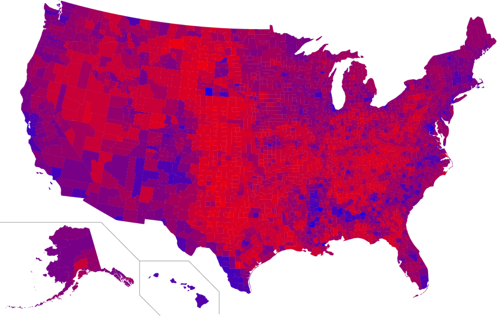
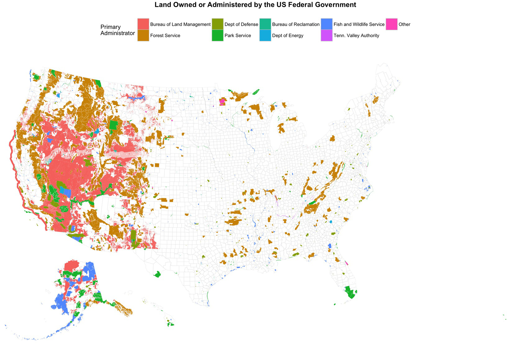

```{r packages, include=FALSE}
library(flipbookr)
library(here)
library(tidyverse)
library(kjhslides)
```


```{r setup, include=FALSE}

kjh_register_tenso()
kjh_set_knitr_opts()
kjh_set_slide_theme()
kjh_set_xaringan_opts()


# Safe
```

class: center middle main-title section-title-1

# .kjh-yellow[Maps and]<br /> .kjh-lblue[Spatial Data] 

.class-info[

**Week 09 (Part 1)**

.light[Kieran Healy<br>
Duke University, Spring 2023]

]

---

layout: true
class: title title-1

---

# Load our libraries

.SMALL[
```{r 05-work-with-dplyr-and-geoms-1, message = TRUE}
library(here)       # manage file paths
library(socviz)     # data and some useful functions
library(tidyverse)  # your friend and mine
library(tidycensus) # Tidily interact with the US Census
library(maps)       # Some basic maps
library(sf)         # Make maps in ggplot
library(tigris)     # Talk to the Census's TIGER data
library(ggforce)    # Useful enhancements to ggplot
```
]

---

class: center middle main-title section-title-1

# .huge[.kjh-lblue[Choropleths]]


---
layout: false

.center[]

.right.w90.small[State-level; vote share; diverging; binned into four categories.]


---
layout: false

.center[]

.right.w90.small[County level; winner only]

---
layout: false

.center[]

.right.w90.small[County level vote share; diverging; binned into six categories]

---
layout: false

.center[]

.right.w90.small[County level vote share; diverging continuous; purple midpoint]

---
layout: false

.center[]

.right.w90.small[County level vote share; purple midpoint; county area deformed in proportion to population. By Mark Newman]

---
layout: false

.center[]

.right.w90.small[Electoral college cartogram]

---

layout: true
class: title title-1

---
layout: false
class: main-title main-title-inv middle

# .middle.squish4.medium[.kjh-lblue[Problems showing] .kjh-orange[Non-Spatial Data]<br /> .kjh-lblue[in choropleth maps]]

---

.center[]

.right.w90.big[Pretty, Big, and Pretty Empty]

---

.center[]

.right.w90.big[Pretty, Big, and Pretty Empty]


---

layout: true
class: title title-1

---


# Aside: What the hell's that?

.center[]

---

# Zoom and Enhance

.center[]

.center.large[Suprisingly, not a coding error on my part.]

---

# It's the .kjh-pink[Transcontinental Railroad]

.center[]

.center.medium[Making its way through the .kjh-lblue[Great Basin], America's largest .kjh-orange[endorheic watershed]. The checkerboard is a deliberate assignation of property rights along the borders of the railway line.]
---

# Still with us, too

.center[]

.center.medium[Not identical, as Interstate 80 was able to go through some parts the railroad had to go around. OK, now back to scheduled programming.]


---

layout: true
class: title title-1

---

class: right bottom main-title section-title-1

## .huge.right.bottom.squish4[.kjh-yellow[U.S. State-Level]<br />.kjh-lblue[Election Data]]

---

# Set up the data

.pull-left.w60[

```{r 07-make-maps-2 }
## Hex color codes for Democratic Blue and Republican Red
party_colors <- c("#2E74C0", "#CB454A")
```

.smaller[

```{r, echo=FALSE, message=FALSE, warnings=FALSE, results='asis'}

hextab <- "
| _Decimal_ | _Binary_ | _Hexadecimal_ |
|---------|--------:|-------------:|
| 0       | 0      | 0           |
| 1       | 1      | 1           |
| 2       | 10     | 2           |
| 3       | 11     | 3           |
| 4       | 100    | 4           |
| 5       | 101    | 5           |
| 6       | 110    | 6           |
| 7       | 111    | 7           |
| 8       | 1000   | 8           |
| 9       | 1001   | 9           |
| 10      | 1010   | A           |
| 11      | 1011   | B           |
| 12      | 1100   | C           |
| 13      | 1101   | D           |
| 14      | 1110   | E           |
| 15      | 1111   | F           |
"

cat(hextab)

```

]
]

--

.pull-right.w40[

## `#`.kjh-red[`2E`].kjh-green[`116`].kjh-blue[`192`]

.center[]

]

???

Hexadecimal numbers are "natural" to computers, because computers store and handle binary digits, and four binary digits make one hexadecimal digit. So one hexadecimal digit can have 16 different values (0 to 15 in decimal), and two hexadecimal digits together (called a "byte") can make 16×16=256 different levels of color. Because each of the three colors can have values from 0 to 255 (256 possible values), there are: 256 × 256 × 256 = 16,777,216 possible color combinations


---

# Set up the data

```{r 07-make-maps-3 }
election |> 
  select(state, total_vote, r_points, pct_trump, party, census)
```

---
`r chunk_reveal("reveal-elecfacet1", widths = c(45,55), title = "# Look before Mapping")`

```{r reveal-elecfacet1, include = FALSE}
## Hex color codes for Democratic Blue and Republican Red
party_colors <- c("#2E74C0", "#CB454A")

election |> 
  filter(st %nin% "DC") |> 
  ggplot(mapping = aes(x = r_points,
                       y = reorder(state, r_points),
                       color = party)) + 
  geom_vline(xintercept = 0, 
             color = "gray30") +
  geom_point(size = 2) + 
  scale_color_manual(values = party_colors) + 
  scale_x_continuous(breaks = c(-30, -20, -10, 0, 
                                10, 20, 30, 40),
                     labels = c("30\n (Clinton)", 
                                "20", "10", "0",
                                "10", "20", "30", 
                                "40\n(Trump)")) + 
  facet_wrap(~ census, ncol=2, 
             scales="free_y") +
  guides(color = "none") + 
  labs(x = "Point Margin", y = NULL) +
    theme(axis.text=element_text(size=8))


```

---

layout: true
class: title title-1

---

# With a bit more room

.pull-left.w60[

```{r 07-make-maps-4, echo = FALSE, fig.height=6, fig.width=8}
## Hex color codes for Democratic Blue and Republican Red
party_colors <- c("#2E74C0", "#CB454A")

p_out <- election |> 
  filter(st %nin% "DC") |> 
  ggplot(mapping = aes(x = r_points,
                       y = reorder(state, r_points),
                       color = party)) + 
  geom_vline(xintercept = 0, 
             color = "gray30") +
  geom_point(size = 2) + 
  scale_color_manual(values = party_colors) + 
  scale_x_continuous(breaks = c(-30, -20, -10, 0, 
                                10, 20, 30, 40),
                     labels = c("30\n (Clinton)", 
                                "20", "10", "0",
                                "10", "20", "30", 
                                "40\n(Trump)")) + 
  facet_wrap(~ census, ncol=2, 
             scales="free_y") +
  guides(color = "none") + 
  labs(x = "Point Margin", y = NULL) +
    theme(axis.text=element_text(size=8))

p_out
```

]

--

.pull-right.w40[

- See how the panels are unbalanced, even with `scales = "free_y"`?

- This happens because we have unequal number of states per region.

]


---

# We can use .kjh-green[`facet_col()`] from .kjh-lblue[`ggforce`]


.pull-left.w45[
```{r codefig-ggforce, message=FALSE, fig.show="hide", fig.width=2.5, fig.height=5.65}

p_out <- election |>
  filter(st %nin% "DC") |>
  ggplot(mapping = aes(x = r_points,
                       y = reorder(state, r_points),
                       color = party)) + 
  geom_vline(xintercept = 0, 
             color = "gray30") +
  geom_point(size = 2) + 
  scale_color_manual(values = party_colors) + 
  scale_x_continuous(breaks = c(-30, -20, -10, 0, 
                                10, 20, 30, 40),
                     labels = c("30\n (Clinton)", 
                                "20", "10", "0",
                                "10", "20", "30", 
                                "40\n(Trump)")) + 
  facet_col(~ census, #<<
            scales="free_y", #<<
            space = "free") + #<<
  guides(color = "none") + 
  labs(x = "Point Margin", y = NULL) +
    theme(axis.text=element_text(size=6), 
          strip.text = element_text(size = rel(0.6)))

p_out

```
]

--

.pull-right.w55[
```{r 07-make-maps-5, echo=FALSE}
  knitr::include_graphics(
  knitr::fig_chunk("codefig-ggforce", "png"))
```
]

