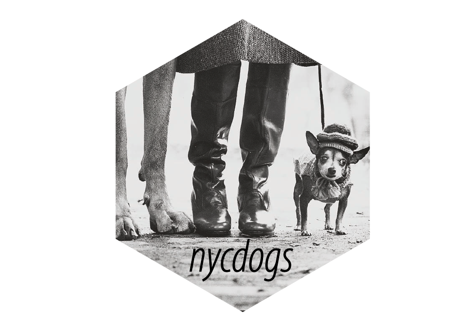

```{r packages, include=FALSE}
library(flipbookr)
library(here)
library(tidyverse)
library(kjhslides)
```


```{r setup, include=FALSE}

kjh_register_tenso()
kjh_set_knitr_opts()
kjh_set_slide_theme()
kjh_set_xaringan_opts()


# Safe
```

class: center middle main-title section-title-1

# .kjh-yellow[Maps and]<br /> .kjh-lblue[Spatial Data] 

.class-info[

**Week 09 (Part 2)**

.light[Kieran Healy<br>
Duke University, Spring 2023]

]

---

layout: true
class: title title-1

---

# Load our libraries

.SMALL[
```{r 05-work-with-dplyr-and-geoms-1, message = TRUE}
library(here)       # manage file paths
library(socviz)     # data and some useful functions
library(tidyverse)  # your friend and mine
library(tidycensus) # Tidily interact with the US Census
library(maps)       # Some basic maps
library(sf)         # Make maps in ggplot
library(tigris)     # Talk to the Census's TIGER data
library(ggforce)    # Useful enhancements to ggplot
```
]

---

class: center middle main-title section-title-1

# .huge[.kjh-lblue[Simple Features]]

---

layout: true
class: title title-1

---


# .kjh-green[`geom_polygon()`] is limiting

- It's very useful to have the intuition that, when drawing maps, .kjh-orange[we're just working with tables] of `x` and `y` coordinates, and .kjh-orange[shapes represent quantities in our data], in a way that's essentially the same as any other geom. This makes it worth getting comfortable with what  .kjh-green[`geom_polygon()`] and .kjh-green[`coord_map()`] are doing. But the business of having very large map tables and manually specifying projections is inefficient. 

--

- In addition, sometimes our data _really is_ properly spatial, at which point we need a more rigorous and consistent way of specifying those elements. There's a whole world of Geodesic standards and methods devoted to specifying these things for GIS applications. R is not a dedicated GIS, but we can take advantage of these tools.

--

- .center.large[Enter .kjh-pink[simple features], the .kjh-lblue[`sf`] package, and .kjh-green[`geom_sf()`]]

---

# The Simple Features package

```{r 07-make-maps-49, echo = FALSE}
detach(package:sf)
```

- When we load .kjh-lblue[`sf`] it creates a way to use several standard GIS concepts and tools, such as the .kjh-lblue[GEOS] library for computational geometry, the .kjh-lblue[PROJ] software that transforms spatial coordinates from one reference system to another, as in map projections, and the Simple Features standard for specifying the elements of spatial attributes. 

```{r 07-make-maps-50, message=TRUE}
library(sf)
```

--

Let's see the main upshot for us as end-users. 

---

# The .kjh-lblue[`nycdogs`] package

.pull-left.w60[
```{r 07-make-maps-51 }
library(nycdogs)
nyc_license
```
]

.pull-right.w40[
.center[]
]

---

# The .kjh-lblue[`nycdogs`] package

- The metadata tells you this is not a regular tibble.

```{r 07-make-maps-52 }
nyc_zips
```

---

# The .kjh-lblue[`nycdogs`] package

```{r 07-make-maps-53 }
nyc_zips |> 
  select(objectid:borough)
```

- The .kjh-orange[`polygon`] column is a list of lat/lon points that, when joined, draw the outline of the zip code area. This is _much_ more compact than a big table where every row is a single point.

---

# Let's make a summary table

---
`r chunk_reveal("reveal-nycfrench", widths = c(40,60), title = "# Let's make a summary table")`

```{r reveal-nycfrench, include = FALSE}
nyc_license  |> 
  filter(extract_year == 2018) |> 
  group_by(breed_rc, zip_code) |> 
  tally() |> 
  mutate(freq = n / sum(n)) |> 
  filter(breed_rc == "French Bulldog") ->
  nyc_fb

```

```{r, echo = FALSE}
nyc_fb <- nyc_license  |> 
  filter(extract_year == 2018) |> 
  group_by(breed_rc, zip_code) |> 
  tally() |> 
  mutate(freq = n / sum(n)) |> 
  filter(breed_rc == "French Bulldog") ->
  nyc_fb
```


---

# Now we have two tables again

.pull-left.w70[
```{r 07-make-maps-54 }
nyc_zips |> select(objectid:st_fips)
```

]

--

.pull-right.w30[
```{r 07-make-maps-55 }
nyc_fb |> select(breed_rc:n)
```

]

--

- Join them:

```{r 07-make-maps-56 }
fb_map <- left_join(nyc_zips, nyc_fb, by = "zip_code")
```


---

# Ready to map

```{r 07-make-maps-57 }
fb_map |> select(zip_code, po_name, borough, breed_rc:freq, geometry)
```

---

# A NYC map theme

- Just moving the legend, really.

```{r 07-make-maps-58 }
theme_nymap <- function(base_size=9, base_family="") {
    require(grid)
    theme_bw(base_size=base_size, base_family=base_family) %+replace%
        theme(axis.line=element_blank(),
              axis.text=element_blank(),
              axis.ticks=element_blank(),
              axis.title=element_blank(),
              panel.background=element_blank(),
              panel.border=element_blank(),
              panel.grid=element_blank(),
              panel.spacing=unit(0, "lines"),
              plot.background=element_blank(),
              legend.justification = c(0,0),
              legend.position = c(0.05, 0.58), 
              legend.direction = "horizontal"
        )
}

```

---
`r chunk_reveal("reveal-bulldogmap", widths = c(40,60), title = "# First cut at a map")`

```{r reveal-bulldogmap, include = FALSE}
fb_map |> 
    ggplot(mapping = aes(fill = freq)) +
    geom_sf(color = "gray30", size = 0.1) + #<<
    scale_fill_viridis_c(option = "A") +
    labs(fill = "Percent of All French Bulldogs") +
    annotate(geom = "text", 
             x = -74.145 + 0.029, 
             y = 40.82-0.012, 
           label = "New York City's French Bulldogs", 
           size = 6) + 
    annotate(geom = "text", 
             x = -74.1468 + 0.029, 
             y = 40.8075-0.012, 
           label = "By Zip Code. Based on Licensing Data", 
           size = 5) + 
    kjhslides::kjh_theme_nymap() + 
   guides(fill = 
           guide_legend(title.position = "top", 
                label.position = "bottom",
                keywidth = 1, 
                nrow = 1))  
 
```
---

`r chunk_reveal("reveal-bulldogmap2", widths = c(40,60), title = "# Use a different palette")`

```{r reveal-bulldogmap2, include = FALSE}
library(colorspace)
fb_map <- left_join(nyc_zips, nyc_fb, by = "zip_code")

fb_map |> 
  ggplot(mapping = aes(fill = freq)) +
  geom_sf(color = "gray30", size = 0.1) +
  scale_fill_continuous_sequential(
    palette = "Oranges",
    labels = scales::label_percent()) +
  labs(fill = "Percent of all French Bulldogs") +
  annotate(geom = "text", 
           x = -74.145 + 0.029, 
           y = 40.82-0.012, 
           label = "New York City's French Bulldogs", 
           size = 6) + 
  annotate(geom = "text", 
           x = -74.1468 + 0.029, 
           y = 40.7955, 
           label = "By Zip Code. Based on Licensing Data", 
           size = 5) + 
  kjhslides::kjh_theme_nymap() + 
  guides(fill = 
           guide_legend(title.position = "top", 
                label.position = "bottom",
                keywidth = 1, 
                nrow = 1))  

```

---
layout: false

```{r 07-make-maps-59, echo = FALSE, fig.width=12, fig.height=8}
fb_map |> 
  ggplot(mapping = aes(fill = freq)) +
  geom_sf(color = "gray30", size = 0.1) +
  scale_fill_continuous_sequential(
    palette = "Oranges",
    labels = scales::label_percent()) +
  labs(fill = "Percent of All French Bulldogs") +
  annotate(geom = "text", 
           x = -74.145 + 0.029, 
           y = 40.82-0.012, 
           label = "New York City's French Bulldogs", 
           size = 6) + 
  annotate(geom = "text", 
           x = -74.1468 + 0.029, 
           y = 40.7955, 
           label = "By Zip Code. Based on Licensing Data", 
           size = 5) + 
  kjhslides::kjh_theme_nymap() + 
  guides(fill = 
           guide_legend(title.position = "top", 
                label.position = "bottom",
                keywidth = 1, 
                nrow = 1))  

```


.right.w90.small[NYC Dogs Map mark 2]

---

layout: true
class: title title-1

---
`r chunk_reveal("reveal-bulldogzeros", widths = c(40,60), title = "# Keep the Zero count zips")`

```{r reveal-bulldogzeros, include = FALSE}

nyc_license  |> 
  filter(extract_year == 2018) |> 
  group_by(breed_rc, zip_code) |> 
  tally() |> 
  ungroup() |> 
  complete(zip_code, breed_rc, 
             fill = list(n = 0)) |> 
  # Regroup to get the right denominator
  group_by(breed_rc) |> 
  mutate(freq = n / sum(n)) |> 
  filter(breed_rc == "French Bulldog") ->
  nyc_fb2

fb_map2 <- left_join(nyc_zips, 
                     nyc_fb2, 
                     by = "zip_code")

```


---

# Ready to map, again

```{r 07-make-maps-60 }
fb_map2 |> select(zip_code, po_name, borough, breed_rc:freq, geometry)
```

- This time, a number of previous .kjh-red[NA] rows are now zeroes instead.

---


---
`r chunk_reveal("reveal-bulldogfb2", widths = c(40,60), title = "# Now redraw the map")`

```{r reveal-bulldogfb2, include = FALSE}
fb_map2 <- left_join(nyc_zips, nyc_fb2, by = "zip_code")

fb_map2 |> 
  ggplot(mapping = aes(fill = freq)) +
  geom_sf(color = "gray30", size = 0.1) +
  scale_fill_continuous_sequential(
    palette = "Oranges", 
    labels = scales::label_percent()) +
  labs(fill = "Percent of all French Bulldogs") +
  annotate(geom = "text", 
           x = -74.145 + 0.029, 
           y = 40.82-0.012, 
           label = "New York City's French Bulldogs", 
           size = 6) + 
  annotate(geom = "text", 
           x = -74.1468 + 0.029, 
           y = 40.7955, 
           label = "By Zip Code. Based on Licensing Data", 
           size = 5) + 
  kjhslides::kjh_theme_nymap() + 
  guides(fill = 
           guide_legend(title.position = "top", 
                        label.position = "bottom",
                        keywidth = 1, 
                        nrow = 1))  

```

---
layout: false

```{r 07-make-maps-61, echo = FALSE, fig.width=12, fig.height=8}
fb_map2 |> 
  ggplot(mapping = aes(fill = freq)) +
  geom_sf(color = "gray30", size = 0.1) +
  scale_fill_continuous_sequential(
    palette = "Oranges", 
    labels = scales::label_percent()) +
  labs(fill = "Percent of all French Bulldogs") +
  annotate(geom = "text", 
           x = -74.145 + 0.029, 
           y = 40.808, 
           label = "New York City's French Bulldogs", 
           size = 6) + 
  annotate(geom = "text", 
           x = -74.145 + 0.028, 
           y = 40.795, 
           label = "By Zip Code. Based on Licensing Data", 
           size = 5) + 
  kjhslides::kjh_theme_nymap() + 
  guides(fill = 
           guide_legend(title.position = "top", 
                        label.position = "bottom",
                        keywidth = 1, 
                        nrow = 1))  

```


.right.w90.small[Zero areas properly zero, missing areas properly missing.]


