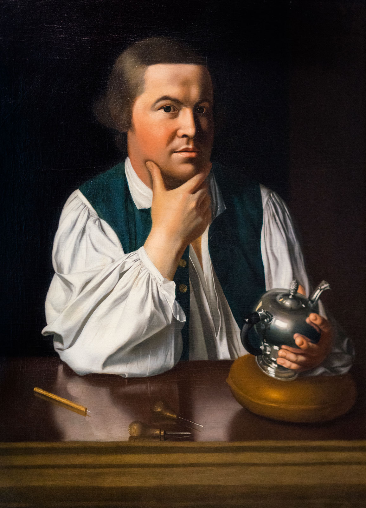

```{r packages, include=FALSE}
library(flipbookr)
library(here)
library(tidyverse)
library(kjhslides)
```


```{r setup, include=FALSE}

kjh_register_tenso()
kjh_set_knitr_opts()
kjh_set_slide_theme()
kjh_set_xaringan_opts()


# Safe
```


class: center middle main-title section-title-1

# .kjh-green[Relational] .kjh-lblue[Data]

.class-info[

**Week 12**

.light[Kieran Healy<br>
Duke University, Spring 2023]

]

---

layout: true
class: title title-1

---

# Load the packages, as always

.SMALL[
```{r 07-iterating-on-data-2, message = TRUE}
library(here)      # manage file paths
library(socviz)    # data and some useful functions
library(tidyverse) # your friend and mine
```
]

---

# Specialty packages

.SMALL[
```{r 07-iterating-on-data-3, message = FALSE}
library(tidygraph) # tidy management of relational data
library(ggraph)   # geoms for drawing graphs

#remotes::install_github("kjhealy/kjhnet")
library(kjhnet)   # some network datasets
```
]

---

# Social Relations and Ties

### Thinking about networks as a kind of social structure

---

# Social Relations and Ties

.middle[]

## The dyad

---

# Social Relations and Ties

.middle[]

## Triads

---

# Centrality in Networks

.middle[]

---

# Centrality as a kind of power

.middle[]

### The 'tertius gaudens' or 'laughing third'

---

# Groups and Categories

.middle[]

--

- The duality of persons and groups

---

layout: false
class: center

.top[]

---

layout: true
class: title title-1

---

# Paul Revere 

.middle[]


---

# Paul Revere 

- St Andrew's Lodge
- The Loyal Nine
- Boston North Caucus
- The Long Room Club
- The Tea Party
- The Boston Committee
- The London Enemies List

---

# Paul Revere

### 7 organizations

### 254 people

---

# Membership table

.middle[]

- This is an _adjacency matrix_.

---

# Membership table ... transposed

.middle[]

---

# The Duality of Persons and Groups

### People are "connected" by their co-membership in groups

### Groups are "connected" by the people they share

### We can move back and forth between these representations

- Breiger (1974)

---

# Moving between the tables

.middle[]

---

# Moving between the tables

.middle[]

---

# Paul Revere: Matrix version

.SMALL[

```{r}
head(revere)
tail(revere)
```

]

---

# Paul Revere: Matrix version

.SMALL[
```{r}
r_p <- as.matrix(revere[,-1]) %*% t(as.matrix(revere[,-1]))
dim(r_p)

r_p[1:6, 1:6]
    
```
]


---

# Paul Revere: Matrix version

.SMALL[
```{r}
r_g <- t(as.matrix(revere[,-1])) %*% as.matrix(revere[,-1])

dim(r_g)

r_g
```
]

---

# Making this tidier

- Network matrices get really large really fast

- They're also usually very _sparse_

- We can't store this data tidily in a _single_ table

- But we can use two. `tidygraph` does this for us. 

---

# Paul Revere: Tidy version

```{r}
revere_groups
```

---

# Paul Revere: Tidy version

```{r}
out <- revere_groups |>
  ggraph(layout = "kk") +
  geom_edge_link(aes(width = value), color = "gray80") +
  geom_node_label(aes(label = name)) + theme_graph()

```

---

layout: false
class: center

```{r, fig.height=10, fig.width=20, echo = FALSE}
print(out)
```

---

layout: true
class: title title-1

---

# Paul Revere: Tidy version

- The person x person network

```{r}
out <-  revere_persons |>
  mutate(centrality = centrality_eigen()) |>
  ggraph(layout = "stress") +
  geom_edge_link0(aes(edge_width = value), color = "gray60") +
  scale_edge_width(range = c(0.02, 2))+
  geom_node_point() +
  geom_node_label(aes(filter = centrality > 0.9, label = name), size = rel(2.5)) + 
  theme_graph()

```

---

layout: false
class: center

```{r, fig.height=10, fig.width=20, echo = FALSE}
print(out)
```
