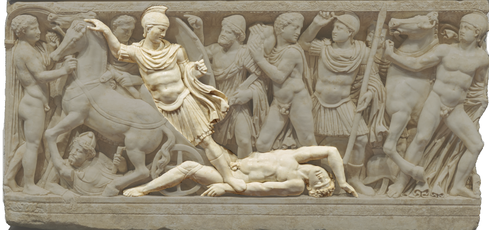
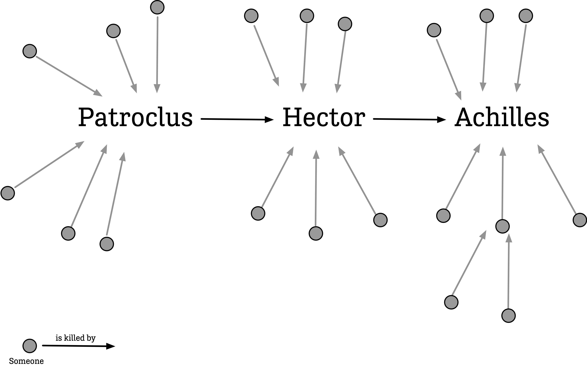

```{r packages, include=FALSE}
library(flipbookr)
library(here)
library(tidyverse)
library(kjhslides)
```


```{r setup, include=FALSE}

kjh_register_tenso()
kjh_set_knitr_opts()
kjh_set_slide_theme()
kjh_set_xaringan_opts()


# Safe
```


class: center middle main-title section-title-1

# .kjh-green[Relational] .kjh-lblue[Data] (pt 2)

.class-info[

**Week 12**

.light[Kieran Healy<br>
Duke University, Spring 2023]

]

---

layout: true
class: title title-1

---

# Load the packages, as always

.SMALL[
```{r 07-iterating-on-data-2, message = TRUE}
library(here)      # manage file paths
library(socviz)    # data and some useful functions
library(tidyverse) # your friend and mine
```
]

---

# Specialty packages

.SMALL[
```{r 07-iterating-on-data-3, message = FALSE}
library(tidygraph) # tidy management of relational data
library(ggraph)   # geoms for drawing graphs

#remotes::install_github("kjhealy/kjhnet")
library(kjhnet)   # some network datasets
```
]

---

# The Iliad

- Who is the most central figure in _The Iliad_?

- We'll use a "dataset" from _The Iliad_ to explore some ideas about ways of measuring centrality and how they express different concepts of social status.

.bottom.smaller.kjh-darkgrey[Thanks to Gabriel Rossman (UCLA) for the data and the topic idea. This lecture follows his exposition.] 


---

# Degree centrality

```{r}
il_tidy
```

---

# Degree centrality

```{r}
out <- il_tidy |>
  activate(nodes) |>
  mutate(centrality = centrality_degree()) |>
  as_tibble() |>
  ggplot(mapping = aes(x = centrality)) +
  geom_histogram() +
  labs(x = "Count of Victories", y = "Count of Warriors ") +
  theme_minimal() +
  theme(legend.position = "top")
```

---

layout: false
class: center

```{r, fig.height=6, fig.width=10}
print(out)
```

---

layout: true
class: title title-1

---

# Degree Centrality (with affiliation)

```{r}
out <- il_tidy |>
  activate(nodes) |>
  mutate(centrality = centrality_degree()) |>
  as_tibble() |>
  arrange(desc(centrality)) |>
  top_n(10, wt = centrality) |>
  ggplot(mapping = aes(x = centrality,
                       y = reorder(name, centrality),
                       color = affil)) +
  geom_point(size = 3) +
  labs(x = "Centrality", y = NULL, color = "Side") +
  theme_minimal() +
  theme(legend.position = "top")
```

---

layout: false
class: center

```{r, fig.height=6, fig.width=10}
print(out)
```

---

layout: true
class: title title-1

---

### Graph representation

```{r}
out <- il_tidy |>
  activate(nodes) |>
  ggraph(layout = "fr") +
  geom_edge_link(color = "gray80") +
  geom_node_point(aes(color = affil)) +
  scale_color_manual(values = c("blue", "red"), 
                     labels = c("Athenian", "Trojan")) +
  guides(color = guide_legend(title = "Side")) +
  labs(title = "Violence in The Iliad") +
  theme(plot.title = element_text(size = rel(3)))

```


---

layout: false
class: center

```{r, fig.height=8, fig.width=15, echo = FALSE}
print(out)
```

---

layout: true
class: title title-1

---

# ... with affiliation 

```{r}
label_colors <- c(prismatic::clr_lighten("blue", 0.7),
                  prismatic::clr_lighten("red", 0.7))
out <- il_tidy |>
  activate(nodes) |>
  mutate(centrality = centrality_degree(mode = "out")) |>
  ggraph(layout = "graphopt") +
  geom_edge_link(aes(start_cap = label_rect(node1.name),
                     end_cap = label_rect(node2.name)),
                 arrow = arrow(length = unit(1.5, 'mm'))) +
  geom_node_point(aes(color = affil)) +
  scale_color_manual(values = c("blue", "red"),
                     labels = c("Athenian", "Trojan")) +
  guides(color = "none", fill = "none") +
  geom_node_label(aes(filter = centrality > 0,
                      label = name, fill = affil),
                      size = rel(2.5)) +
  scale_fill_manual(values = label_colors) +
  labs(title = "Violence in The Iliad") +
  theme_graph() +
  theme(plot.title = element_text(size = rel(3)))
```

---

layout: false
class: center

```{r, fig.height=8, fig.width=15, echo = FALSE}
print(out)
```

---

layout: true
class: title title-1

---

# Betweenness centrality

```{r}
out <- il_tidy |>
  activate(nodes) |>
  mutate(centrality = centrality_degree(),
         betweenness = centrality_betweenness()) |>
  as_tibble() |>
  arrange(desc(betweenness)) |>
  top_n(10, wt = betweenness) |>
  ggplot(mapping = aes(x = betweenness,
                       y = reorder(name,
                       betweenness), color = affil)) +
  geom_point(size = 3) +
  labs(x = "Betweenness", y = NULL, color = "Side") +
  theme_minimal() +
  theme(legend.position = "top")
```

---

layout: false
class: center

```{r, fig.height=5, fig.width=10, echo = FALSE}
print(out)
```

---

.middle[]

---

.middle[]

---

layout: true
class: title title-1

---

# Alpha centrality

```{r }

out <- il_tidy |>
  activate(edges) |>
  filter(act == "kills") |>
  reroute(from = to, to = from) |>
  activate(nodes) |>
  mutate(alpha = centrality_alpha()) |>
  as_tibble() |>
  arrange(desc(alpha)) |>
    top_n(10, wt = alpha) |>
  ggplot(mapping = aes(x = alpha,
                       y = reorder(name, alpha),
                       color = affil)) +
  geom_point(size = 3) +
  labs(x = "Alpha Centrality", y = NULL, color = "Side") +
  theme_minimal() +
  theme(legend.position = "top")
```

---

layout: false
class: center

```{r, fig.height=5, fig.width=8, echo = FALSE}
print(out)
```

